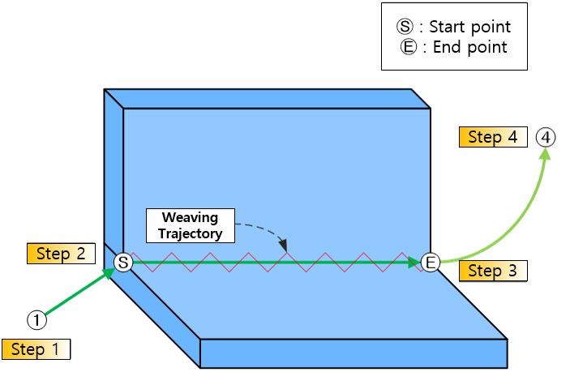
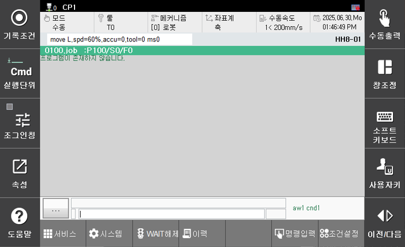
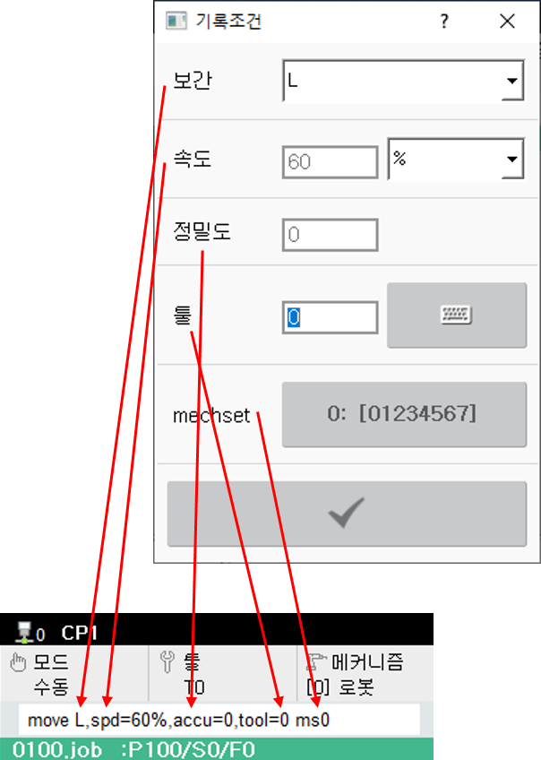
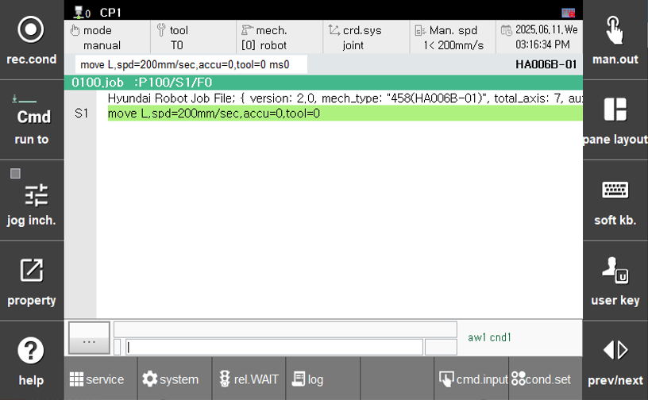
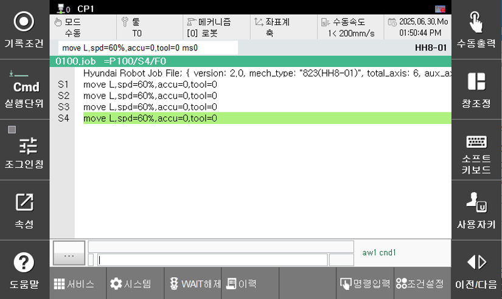
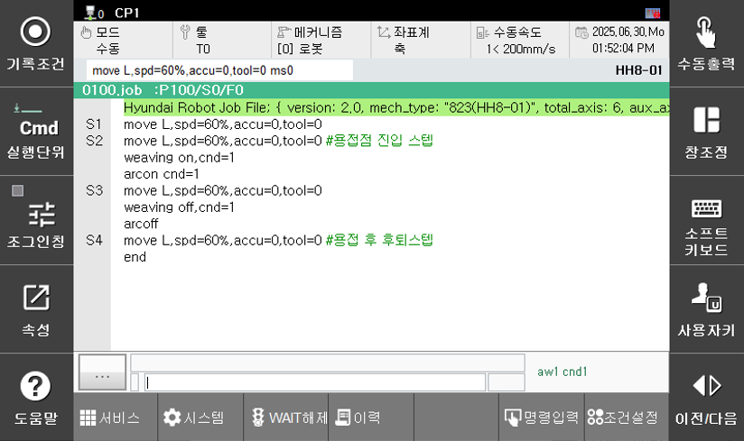

# 1.1 Overview

Teach the Arc welding operation as shown in the following figure.

  </img>
  <em>
Figure 1.1.1. Basic Arc Weld Teaching
</em>

 

(1) Turn on the power switch on the front of the Controller.

(2) Select the `[mode witch]` on the (Teach Pendant)TP in manual mode.

(3) Press the `[Program]` on the TP and enter the program number.

(4) If you proceed this far, the TP screen will be displayed as shown below.

  </img>
  <em>
Figure 1.1.2. Screen with new program number selected
</em>

 

(5) Press the `[Motor On]` button on the TP to power the robot's motor.

(6) Use the axis control key to move the robot's torch to the position in Step 1.

(7) Press the `[rec. cond]` key, then specify the desired interpolation type, speed, accuracy, and tool number.  

- After moving to the desired item using the direction key, set the value and press the `[ENTER]` key to save the setting
- press the `[tool]` key and enter the desired tool number.

 </img>
 <em>
Figure 1.1.3. Recording Conditions
</em>

 

- Press the `[rec. cond]` key to record the step as shown below.

 </img>
 <em>
Figure 1.1.4. Program with recorded Step (1)
</em>

 

(8)	Repeat steps 5 through 7 for steps 2 through 4.
 

 </img>
 <em>
Figure 1.1.5. Program with recorded Step (2)
</em>

(9) Since the welding area is from Step 2 to Step 3, move the cursor to Step 2.

- Enter the `[F6: cmd. Input] - arcweld - weaving`, input the condition number, and press the `[ENTER]` key.
- In the same way, enter the **[arcon]**, input the condition number, and press the `[ENTER]` key.
(For Arc Welding condition settings, refer to [5. Editing Arc Welding Conditions](../../5_Condition_editing/README.md).)

(10) Move the cursor to Step 3, which is the step where Arc Welding ends.
 
- Again, enter the **[weaving]** and set it to off.
- Also, enter the **[arcoff]**.

(11) Modify the speed of Step 3 to your desired welding speed (e.g., 20mm/s).

(12) Finally, enter the `[F6: cmd. input] - flowctrl - end` command to terminate the program.

 </img>
 <em>
Figure 1.1.6. Teaching Completion Screen
</em>

