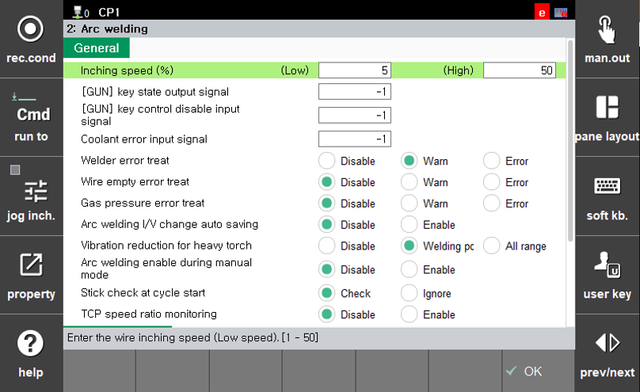

# 1.2.2 Arc Welding various signals and funtion settings

On the manual mode screen, press `[F2: System] - 4: Application parameter - 2: Arc welding` to bring up a screen where you can set various conditions for Arc welding applications, as shown below.

 
*Figure 1.2.2. Arc Welding Application parameter Dialog*
 

The details for each item are as follows:

#### [General]
* Inching speed(%)
| Item | Description |
|------|------|
|`(Low)`[1 ~ 50] % `(High)`[10 ~ 100] %| This refers to the wire feed speed when jogging the wire forward(`[SHIFT]+[2]` (wire inching)) or backward(`[SHIFT]+[3]` (wire retreat)).  You can set the feed speed for both low-speed and high-speed operation (when the key is pressed for 3 seconds or more).|

* `[GUN]` key status output signal
| Item | Description |
|------|------|
|output signal| Set the signal to output the current status of the `[GUN]` key on the TP.|

* `[GUN]` key control disable input
| Item | Description |
|------|------|
|Input signal| Assign an input signal to externally control the `[Gun]` key's on/off status. Once this signal is assigned, you won't be able to change the arc welding on/off status by pressing the `[GUN]` key on the TP. This function helps prevent issues where welding might be skipped in a welding section due to accidential presses of the `[GUN]` key.  (When the assigned signal is received, the LED of the `[GUN]` key turns off, and the robot enters a `Dry Run` state where no welding is performed in the arc welding section, despite the robot running.)|

* Coolant Error Input Signal
| Item | Description |
|------|------|
|Input Signal| For water-cooled Arc welding torches, a signal is configured to detect issues with coolant circulation. When this signal is received during welding, it is considered an error, which triggers the robot's operation and welding process to stop.|

* Welder Error treat
| Item | Description |
|------|------|
|[`Disable`, `Error`, `Error`]| Set how to handle welder errors.|

* Wire Empty error treat
| Item | Description |
|------|------|
|[`Disable`, `Error`, `Error`]| Set the error handling method when no welding wire is present.|

* Gas Pressure Error treat
| Item | Description |
|------|------|
|[`Disable`,`Error`, `Error`]| Set the error handling method in case of gas pressure abnormalities.|

* Arc Welding I/V change auto saving
| Item | Description |
|------|------|
|[`Disable`, `Enable`]| This setting determines whether to automatically save changes to current and voltage values when they are changed within the `arc change IV(Arc Welding Current/Voltage Adjustment dialog box)`. For more details, please refer to [[1.3.3 Change the Current/Voltage during Welding]](../3_Convenient_functions/3_change_current_voltage/README.md).|

* Vibration reduction for heavy torch
| Item | Description |
|------|------|
|[`Disable`, `Welding point`, `All range`]| This setting is designed to reduce vibrations when using heavy torches. It helps to minimize vibrations that may occur when using heavy torches such as water-cooled or push-pull torches.  When set to `Welding Points`, a significant reduction in vibrations can be achieved in the welding point entry section without substantial changes in the robot's operating speed.  When set to `All range`, a filter specifically designed for heavy Arc torches is applied, virtually eliminating vibrations throughout the entire preocess. However, this may result in a decrease in the robot's operating speed.|

* Arc welding enable during manual mode
| Item | Description |
|------|------|
|[`Disable`, `Enable`]| This setting determines whether welding can be performed through ste-forward in manual mode.  When set to `Enable`, welding can be performed by stepping forward to the Arc welding section, with the execution unit set to `End`. For more details, please refer to [[1.3.4 Manual mode Arc Welding]](../3_Convenient_functions/4_manual_mode.md).|

* Stick check at cycle start
| Item | Description |
|------|------|
|[`Check`, `Ignore`]| This setting determines whether a wire stick check will be performed when the robot starts its first cycle.  When `"check"` is enabled, the robot will perform a check for approximately 0.2 seconds at the beginning before proceeding with movement.|

* TCP speed ratio monitoring
| Item | Description |
|------|------|
|[`Disable`, `Enable`]| This setting determines whether to monitor the rate of change in the TCP speed.|

#### [Touch Sensing]
* Touch Sensing Stop Setting
| Item | Description |
|------|------|
|[`Immediately`, `Normal`]|Set whether to `immediately stop` or `normal stop` when Touch Sensing detects a work piece. If wire bending increases during a normal stop, set it to `immediately stop`|

#### [Arc trajectory Monitoring]
* Activation
| Item | Description |
|------|------|
|[`Disable`, `Enable`]|Sets whether to monitor the Arc trajectory.|

