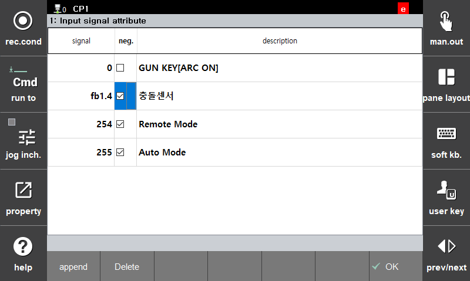

# 1.2.3 충돌센서 신호 설정
아크용접로봇 시스템은 토치의 변형을 방지하기 위해 충돌센서를 사용합니다. 충돌센서는 기본적으로 부논리를 사용하여 센서 케이블의 단선 등이 발생 시 바로 확인할 수 있도록 합니다.

설정 대화상자는 다음과 같습니다. 

**『시스템』 → 『1: 사용자 환경』** 에서 충돌센서 처리 방법을 설정할 수 있습니다.  
## [충돌센서 처리]
: [**비상정지**, **정지**]  

---  

### 비상정지
: 충돌센서 신호 입력 시 로봇이 모터를 off하고 비상 정지 수행

---  

### 정지
: 충돌센서 신호 입력 시 로봇이 모터를 On상태로 유지하고 정지 수행

---  

## [신호논리 변경 방법]

툴이 충돌하여 충돌센서 신호가 on될 경우 모터온이 되지 않습니다. 이러한 경우에는 다음과 같이 신호논리를 부논리로 바꾸어 주어야 합니다. 

- **『시스템』 - 『제어파라미터』 - 『입력/출력 신호 설정』 - 『입력신호 속성』** - 신호 추가 및 부논리 체크박스 로 정논리/부논리 변경

 </img>
 <em>
신호 논리 반전 방법
</em>


[기타 항목] 
시스템의 입력신호 설정 항목에서 충돌 센서를 설정하는 경우 이 신호의 입력을 우선 확인하며 용접기 통신으로 입력되는 충돌 센서 신호 입력은 무시됩니다.
