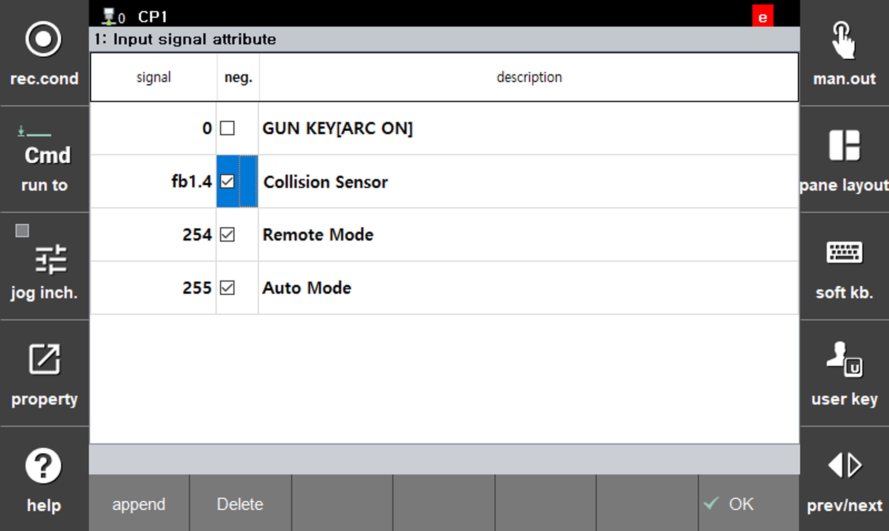

# 1.2.3 Collision sensor signal settings

Arc welding robot systems uses a collision sensor to prevent torch deformation. The collision sensor basically uses negative logic to immediately detect issues such as a disconnected sensor cable.

The setup dialog box is as follows:

You can configure the collision sensor processing method on **[System > 1: User Environment]**.

## [Collision sensor process]
| item | Description |
|------|------|
|**Emergency Stop**|When a collision sensor signal is input, the robot turns off its motor and performs an emergency stop|
|**Stop**|When a collision sensor signal is input, the robot keeps its motors On and performs a stop|

## [How to Change Signal Logic]
If the tool collides and the collision sensor signal turns on, the motor will not turn on. In this case, you need to change the signal logic to negative logic as follows.

- **[System > 2: Control parameter > 2: Input/Output signal setting > 1: Input signal attribute]** - Adding a Signal and Checking the Negative Logic Box  

 </img>
 <em>
Figure 1.2.3. How to Change Signal Logic
</em>


When you set up a collision sensor in the system's input signal settings, the system will prioritize the input from this signal. Any collision sensor signals received via welder communication will be ignored.

