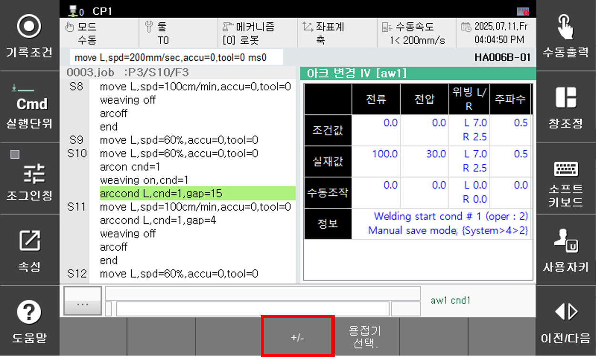
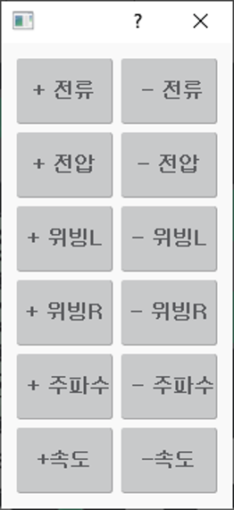

# 1.3.3 용접 중 전류/전압 변경 기능

Arc 용접작업을 티칭할 때 적절한 용접 전류/전압을 찾기 위해서 용접 수행 중 전류/전압을 변경해야 하는 경우 사용하는 기능입니다.

이 기능을 이용하면 용접 중 실시간으로 전류/전압을 변경하여 최적 조건을 찾고 확인된 조건을 바로 용접조건으로 저장하는 것이 가능합니다.

기능의 세부 내용 및 설정 방법은 다음과 같습니다. 여기서 %는 용접기의 최소와 최대값의 차이에 대한 단위 입니다.

---  

### Arc 용접 전류/전압 변경 대화상자 진입

<p align="center">
 </img>
 <em><p align="center">그림 1.3.1. Arc용접 프로그램 및 전류전압 변경</p></em>
</p>

<br>

- 자동모드에서 Arc 용접을 수행
- **[창조정] – [선택] – [아크IV변경]** 선택
- 버튼 **[+/-]** 를 클릭하여 조절버튼 창 진입

---  

### 용접 중 조정 키

|      | [+ 전류]/[- 전류]                   |`[SHIFT]` + [+ 전류]/[- 전류] |
| ------ | --------------------- |--------------------- |
| **용도** | 용접전류 1% 증/감         |용접전류 5% 증/감|

|      | [+ 전압]/[- 전압]                   |`[SHIFT]` + [+ 전압]/[- 전압] |
| ------ | --------------------- |--------------------- |
| **용도** | 용접전압 1% 증/감         |용접전압 5% 증/감|

|      | [+ 위빙L]/[- 위빙L]                   |`[SHIFT]` + [+ 위빙L]/[- 위빙L] |
| ------ | --------------------- |--------------------- |
| **용도** | 위빙 폭(좌) 0.1[mm] 증/감         |위빙 폭(좌) 0.5[mm] 증/감|

|      | [+ 위빙R]/[- 위빙R]                   |`[SHIFT]` + [+ 위빙R]/[- 위빙R] |
| ------ | --------------------- |--------------------- |
| **용도** | 위빙 폭(우) 0.1[mm] 증/감         |위빙 폭(우) 0.5[mm] 증/감|

|      | [+ 주파수]/[- 주파수]                   |`[SHIFT]` + [+ 주파수]/[- 주파수] |
| ------ | --------------------- |--------------------- |
| **용도** | 위빙 주파수 0.1[Hz] 증/감         |위빙 주파수 0.5[Hz] 증/감|


---  


### 전류/전압 변경 자동저장 설정 변경

- **[시스템]』 → 『4: 응용 파라미터』 → 『2: 아크용접』** 대화상자 진입
- **[Arc 용접 전류/전압 변경 자동저장 설정]**
    - **무효**  
    저장 안됨  

    - **유효**  
    사용자가 값을 변경하는 즉시 용접조건에 저장

---  


### 조작

대화상자의 항목 별 내용은 다음과 같습니다. 

<p align="center">
 </img>
 <em><p align="center">그림 1.3.2. Arc 용접 전류/전압 변경 대화상자</p></em>
</p>   

<br>


- 전류/전압 변경은 용접시작조건에만 저장되며, 종료조건에는 저장되지 않습니다.

- ```arcon``` 명령어 형태 중 전류, 전압 값을 별도로 지정한 형태의 명령어인 경우 용접 조건에만 변경내용이 저장됩니다.

- 예시) ```arcon cnd=1,cur=200,vol=20``` <span style = "color:green"># 용접시작조건 1번에 변경된 전류, 전압이 저장</span>
