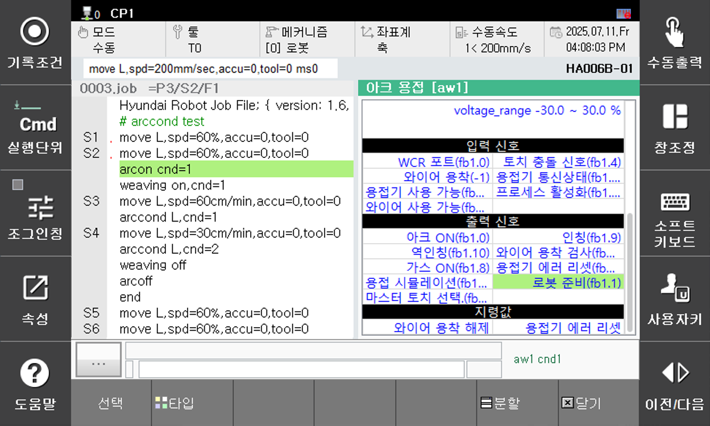

# 1.3.6 Arc Welding signal test function

The Arc Welding Signal Test function lets you test the input/output status of key welding signals and manually release wire stick-out. This feature is useful for checking the status of welder and communication as it confirms wheter specific signals are operating correctly.

To use this feature, on TP, press `[pane layout] - select - arc welding` sequentially. In the Arc Welding panel, scroll down to see the input/output signal items.

 
*Figure 1.3.3. Arc Welding Monitoring*

| Item | Description |
| ------------- | ---------------------------------------------------------- |
| **Output Signal** | With the desired output signal selected, click the **[Manual Output]** button to test turnning the signal on/off. |
| **Input Signal**| You can verify whether input signals are being recieved correctly according to their operation. |
| **Command Value**| <li>**Manual Wire Stick-out Release**: Select "Stick check" and click the **[Manual Output]** button. </li> <li>**Manual Welder Error Reset**: Select "Welder Error Reset" and click the **[Manual Output]** button. </li>|
