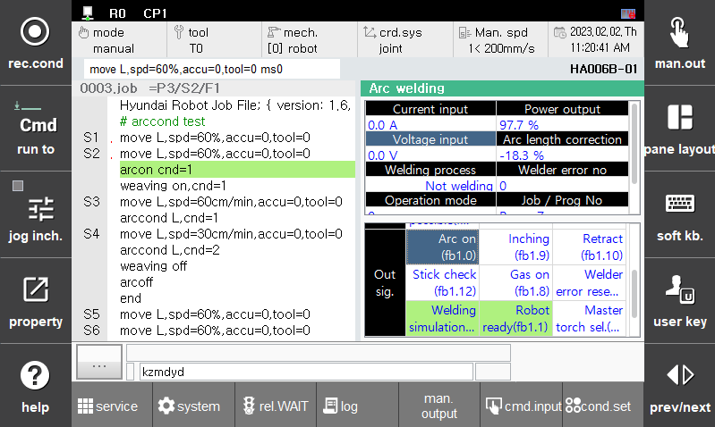

# 1.3.6 Arc 용접 신호 시험 기능

Arc 용접 신호 시험 기능은 용접에 필요한 주요한 신호의 입출력 상태를 테스트하고, 수동으로 용착 해제할 수 있는 기능입니다. 본 기능은 특정 신호의 동작 여부를 확인할 수 있기 때문에 용접기 및 통신의 이상 상태를 점검할 때 유용하게 사용할 수 있습니다.

본 기능을 사용하기 위해서는 티칭 펜던트 기본화면에서 **[창조정]** 을 눌러 **[선택]** 에서 **[아크용접]** 을 선택합니다. 아크 용접 패널에서 스크롤을 하단으로 움직여 입력/출력 신호 항목을 확인할 수 있습니다.  

 </img>
 <em>
그림 1.11 Arc 용접 모니터링
</em>

---  

### 출력 신호
원하는 출력신호를 선택한 상태에서 **[수동 출력]** 버튼을 클릭하여 신호를 on/off 테스트 할 수 있습니다.

---  

### 입력 신호
입력 신호가 동작에 맞게 입력되고 있는지를 확인 할 수 있습니다.

---  

### 지령값
와이어 용착 해제를 선택한 상태에서 **[수동 출력]** 버튼을 클릭하여 수동으로 용착해제를 명령할 수 있습니다.  
용접기 에러 리셋을 선택한 상태에서 **[수동 출력]** 버튼을 클릭하여 수동으로 용접기 에러 리셋을 명령할 수 있습니다.
 
---  

