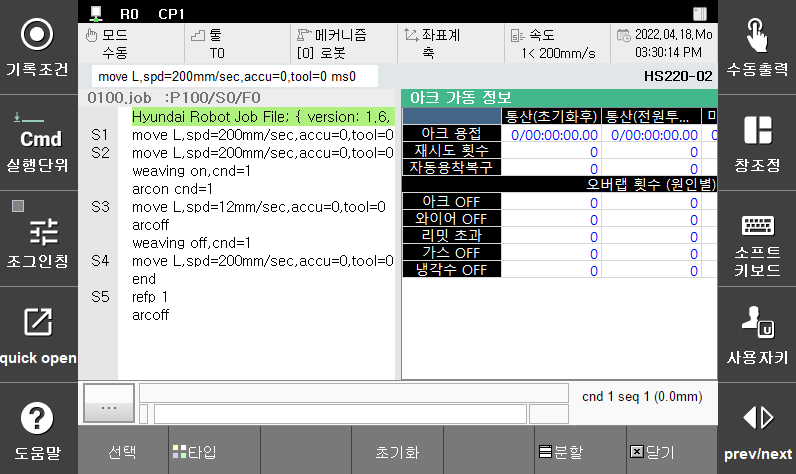

# 1.3.7 아크용접 가동정보

Arc 용접을 수행한 가동정보를 모니터링 창을 이용하여 확인하는 기능입니다. 이 기능을 이용하여 아래와 같은 사항을 쉽게 확인하고 관리할 수 있습니다.  

본 기능을 사용하기 위해서는 티칭 펜던트 기본화면에서 **[창조정]** 을 눌러 **[선택]** 에서 **[아크 가동정보]** 를 선택합니다. 

 </img>
 <em>
그림 1.12 아크용접 가동정보 모니터링 창
</em>

  

### 통산(초기화후)
>시스템 초기화부터 용접 시간 및 자동으로 수행된 재시도/자동용착해제 횟수를 확인할 수 있습니다.

### 통산(전원투입후)
>시스템 전원 투입 후부터 용접 시간 및 자동으로 수행된 재시도/자동용착해제 횟수를 확인할 수 있습니다.

### 마지막 사이클
>바로 직전 사이클의 용접 시간 및 자동으로 수행된 재시도/자동용착해제 횟수를 확인할 수 있습니다.

### 현재 사이클
>현재 사이클의 용접 시간 및 자동으로 수행된 재시도/자동용착해제 횟수를 확인할 수 있습니다.

### 오버랩 횟수 (원인별)
>용접 중 로봇이 정지하는 경우 수행되는 오버랩의 횟수를 발생 원인 별로 확인할 수 있습니다.

### 아크용접 가동정보 초기화
>아크용접 가동정보 창이 활성화 되면 **[초기화]** 버튼이 나타나며, 이를 누르면 가동정보 클리어 대화상자가 표시됩니다. 클리어를 원하는 항목의 버튼을 클릭하면 원하는 동작이 수행됩니다.
