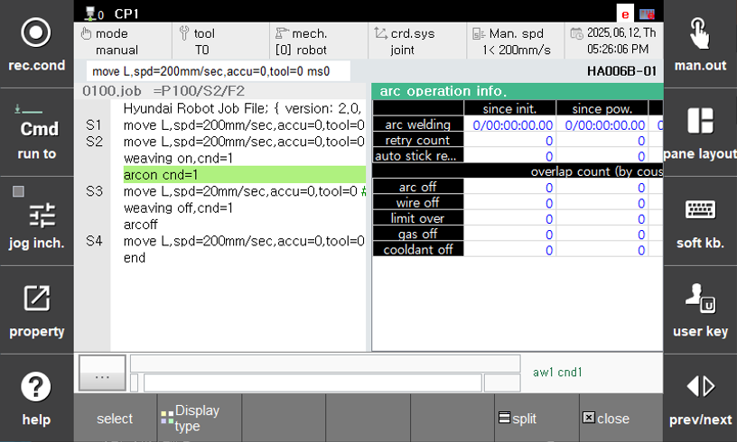

# 1.3.7 弧焊操作信息

此功能允许您监控弧焊的操作信息。借助此功能，您可以轻松检查和管理以下方面：

要使用此功能，请在 TP 上按 `[pane layout] - 选择 - 弧操作信息 ([pane layout] - select - arc operation info.)` 依次进行。

 
*图 1.3.4. 弧焊操作信息监控*  

| 项目 | 描述 |
| --- | --- |
| **自初始化以来** | 显示焊接时间，以及自动重试次数和自动送丝释放计数 **自系统初始化以来**。 |
| **自上电以来** | 显示焊接时间，以及自动重试次数和自动送丝释放计数 **自系统上电以来**。 |
| **上一个周期** | 显示焊接时间，以及自动重试次数和自动送丝释放计数 **在上一个周期**。 |
| **当前周期** | 显示焊接时间，以及自动重试次数和自动送丝释放计数 **在当前周期**。 |
| **重叠计数（按原因）** | 显示焊接时机器人停止发生重叠的次数，按停止原因分类。 |
| **清除（在 fbt 上）** | 当弧焊操作信息窗口被激活时，**[clear]** 按钮会出现。点击此按钮将显示操作信息清除对话框。您可以点击您希望清除的项目的按钮以执行所需操作。 |