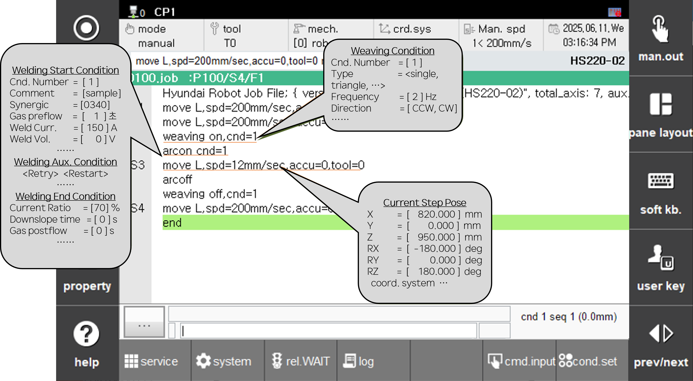

# 3.1 개요

Arc용접을 위한 작업 프로그램을 티칭할 때 전압, 전류 등 용접조건뿐만 아니라 위빙과 재시도/오버랩, 용접기의 특성 등 Arc 용접 기능의 세부적인 설정이 필요합니다. 또한 Arc 용접뿐만 아니라 로봇을 사용하는 일반적인 상황에서 티칭된 스텝이나 보조점의 위치의 정보(좌표 및 자세 등)를 확인해야 하는 경우도 있습니다.  
명령어에 커서를 위치한 후, 티칭 펜던트의 좌측에 위치한 [**속성**] 버튼을 누르면 이러한 파일들을 쉽고 빠르게 편집할 수 있는 기능을 제공합니다.

### 명령어 [속성]창 예시
|명령어|속성 창|
|-----|-------|
|`arcon`|전류, 전압, 시너직, 초기조건, 종료조건, 재시도조건, 재기동조건 등을 설정합니다.  |
|`weaving on`|위빙형상, 위빙 주파수, 위빙 폭, 위빙방향 등을 설정합니다.  |
|`lvs`|추종관련 정보, seam finding 관련 설정 등을 할 수 있습니다.  |
|`arccond`|WDB(용접조건 데이터베이스)를 전류, 전압, 주파수, 위빙폭 등을 관리할 수 있습니다.  |
|`move`|현재 기록된 위치를 베이스좌표계, 로봇좌표계, 축좌표계 등으로 바꿀 수 있습니다. |


용접시작조건의 편집을 예로 들면, 아크를 on 시키는 ```arcon``` 명령문에 커서가 있을 때 [**속성**] 버튼을 누르면 용접시작조건 중 현재 명령문에서 사용하는 조건번호의 내용이 표시됩니다. 이 화면에서 용접시작조건의 세부내용을 확인하거나 변경할 수 있습니다.

이처럼 특정 명령문에 커서를 위치시킨 후 [**속성**] 창에 진입하면 조건을 설정하거나 스텝에 기록된 위치 등 세부내용을 쉽고 빠르게 확인 및 변경 할 수 있습니다.

 
<p align="center">
 </img>
 <em><p align="center">그림 3.1.1. 로봇 프로그램에서 '속성'</p></em>
</p>

특정 명령문에서 [**속성**]을 누르면 관련된 파일이나 상세 내용을 화면에 표시합니다. 변경된 내용을 파일에 저장 후 종료를 원할 경우 [**완료**]를, 저장하지 않고 종료를 원할 경우 티칭 펜던트의 [`ESC`]키를 누릅니다.
 
