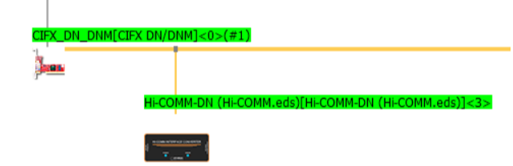

# 4.1 Arc 용접기 통신 연결

PC와 제어기를 이더넷 케이블로 연결하기 위해 아래 순서대로 진행합니다.

1. PC에서 **Sycon** 프로그램을 실행합니다. 
2. cifx카드를 추가하고 아이콘을 우측클릭하여 **configuration**을 클릭합니다.  
3. 각 항목에 대해 아래와 같이 설정합니다.  
**Driver** : netX Driver로 설정  
**Bus Parameters** : Baud rate을 250kBits/s로 설정  
**Device Assignment** : 추가된 cifx카드를 클릭하고 OK를 클릭합니다.    
4. cifx 아이콘을 우클릭하여 **download** 합니다. 
5. cifx 아이콘을 우클릭하여 **네트워크 스캔**을 누릅니다.

 </img>
 <em>
그림 4.1.1. Sycon 통신 상태
</em>

 
 
여기까지 진행할 경우 Sycon은 위와 같은 화면이 됩니다. (현대PNS용접기 연결시)  

6. 용접기에 해당하는 아이콘에서 우측클릭 후 **disconnect** 후 configuration에서 General항목에 있는 **UCMM**을 **Group3**으로 설정합니다.  
7. 용접기 아이콘을 우측클릭하여 **upload**한 후 cifx 아이콘을 우클릭하여 **download** 합니다.

모든 과정이 끝났으면 로봇 티칭팬던트의 **[설정]-[제어파라미터]-[입출력신호설정]-[fb블럭 할당]** 메뉴에서 사용할 블록을 할당합니다.   
여기까지 끝났다면, 용접기로부터 제어기로 송신한 데이터들이 할당한 블록내에 굵은 글씨로 표시될 것입니다. (`[(우측 패널)창조정] - 선택 - 범용 입력`을 선택하여 **fb{할당한 번호}/9.di** 에서 확인)


    자세한 내용은 [${cont_model} - Industrial Communication](https://hrbook-hrc.web.app/#/view/doc-industrial-communication/ko/README?cont_model=${cont_model})을 참고하십시오.  
