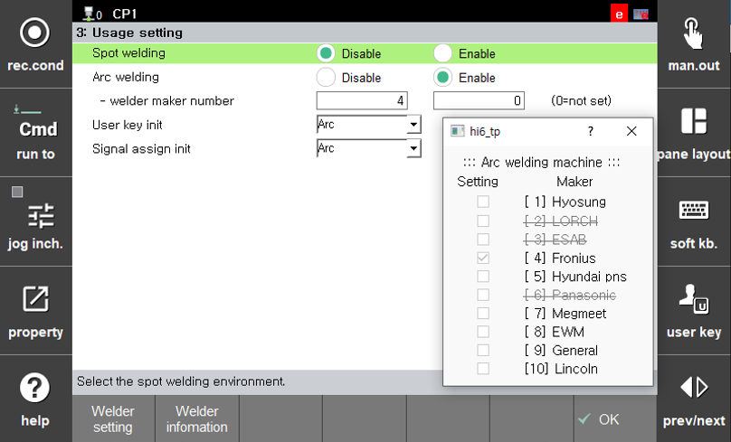
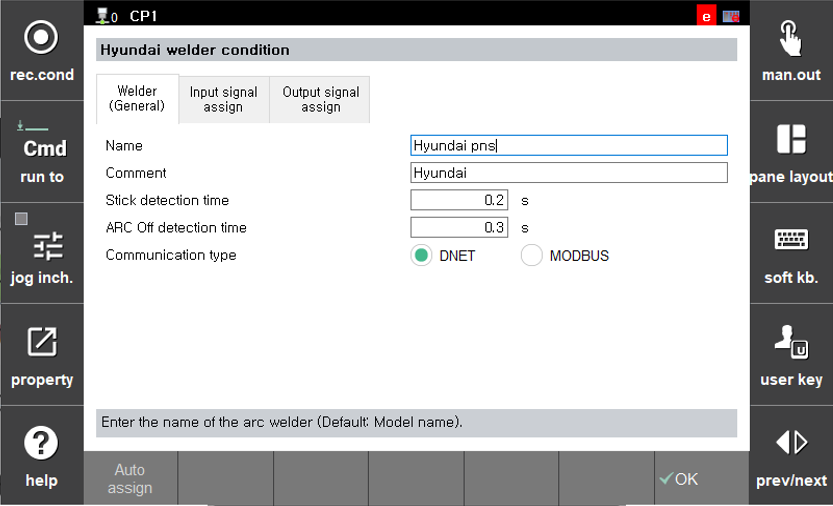
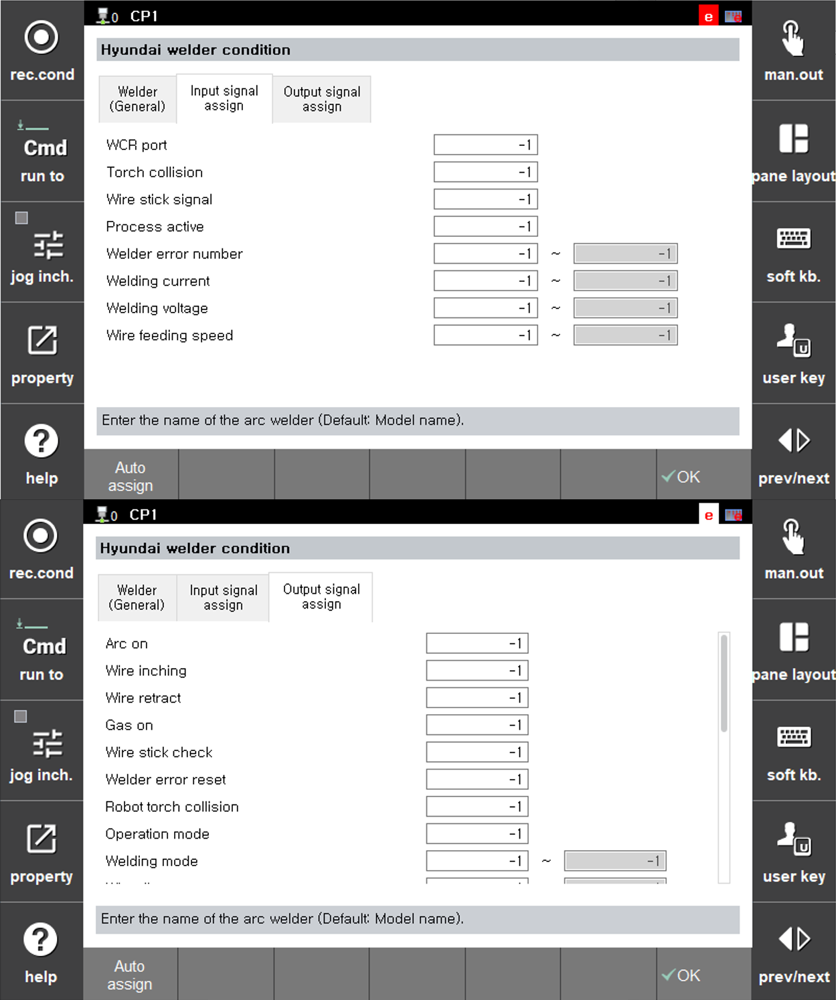

# 4.2 Arc Welder Settings

User can operate various welders together with our Arc Welding Robots. To support this, a function is provided to edit welder-specific settings. The welder configuration screen can be accessed as follows: `[F2: System] - 5: Initialization - 3: Usage setting`

###	Welder Maker Number
> The currently selected welder maker number is displayed. You can check the welder numbers for each maker by clicking the **[Welder information]** button. By clicking the **[Welder setting]** button on this screen, the condition editing screen for the selected welder will appear.

 </img>
 <em>
Figure 4.2.1. Usage Setting Dialog box
</em>

 

 

 </img>
 <em>
Figure 4.2.2. Hyundai Welder Condition Settings
</em>

   

 

 </img>
 <em>
Figure 4.2.3. Hyundai Welder I/O Signal Assignment
</em>

   

The welder condition screen provides editing functions related to welder characteristics, so the editable items differ by welder. The following items are commonly editable in the welder condition screen.

| Item | Default Value | Description |
|---|------|---|
| Name                   | Supported welder model name | Records the model name of the welder |
| Comment                | Welder Maker name | Records a description of the welder |
| Stick detection time   | [0.2] seconds  (Range: 0.1 ~ 10.0) | Checks wire fusion during setting time after arc welding ends |
| ARC OFF detection time | [0.3] seconds  (Range: 0.0 ~ 10.0) | Sets the reference time for detecting arc off during arc welding. If the arc is off longer than this time, it is recognized as arc off.  It set too low, arc ignition failures may occur frequently.  If set too high, robot movement and wire inching continue longer after arc off, increasing the robot travel distance and wire protrusion length after arc off. |

