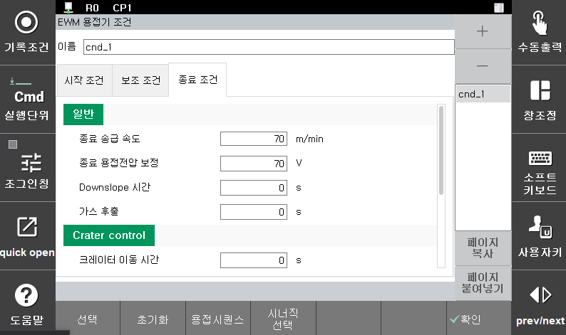

# 5.3.2 용접 시작 조건 – GB2/GZ4/GE2 전용 설정

(1)	슬로우다운 조정: [  0] % (범위: -10 ~ 10)  
Arc 발생 전까지 와이어를 송급하는 기본 속도의 옵셋을 설정합니다.

(2)	단락초기시간 조정(Tso): [ 0] (범위: -3 ~ 3)  
용접 풀에 와이어가 닿은 후 전류 상승을 억제를 설정합니다.
이 값이 작아지면 충격은 작아지고 스패터가 증가하며 Arc 유지성이 나빠집니다.
이 값이 커지면 충격은 커지지만 Arc 유지성이 향상됩니다.

(3)	단락전류굴절값 조정(Isc): [ 0] (범위: -3 ~ 3)  
슬로프 1과 2를 연결하는 전류값 조정을 설정합니다.
이 값이 작아지면(-) 스패터가 적어지지만 Arc 유지성이 나빠지고 소리가 부드러워집니다. 이 값이 커지면(+) Arc 유지성이 향상되지만 스패터가 많아집니다.

(4)	단락전류구배1 조정(Isl1): [ 0] (범위: -7 ~ 7)  
이 값이 작아지면(-) Arc를 부드럽게 만들고 스패터 양이 적어집니다.
이 값이 커지면(+) 고속용접에서 Arc 안정성이 향상되지만 시간이 지나면서 뭉쳐진 스패터가 발생합니다.

(5)	단락전류구배2 조정(Isl2): [ 0] (범위: -7 ~ 7)  
이 값이 작아지면(-) 스패터 양은 줄고 전극이 용융 풀에 접촉 시 충격이 증가합니다. 이 값이 커지면(+) 고속용접에서 Arc 안정성이 향상되지만 더 많은 스패터가 발생합니다.

(6)	Arc전류굴절값 조정(Iac): [ 0] (범위: -3 ~ 3)  
Arc 발생 시 굴곡전류 조정값을 설정합니다. 이 값을 통하여 Arc발생순간에 스패터량을 억제하고 Arc가 다시 발생하는 순간의 Arc길이를 결정합니다.

(7)	부딪침 방지시간 조정(Tsp): [ 0] (범위: -3 ~ 3)  
용착 방지시간(Time stick prevention)을 설정합니다.

(8)	Hot 전류 조정(Ihot): [ 0] (범위: -3 ~ 3)  
용접 시작 시 사용하는 높은 전류값을 조정합니다.

(9)	Hot 전압 조정(Vhot): [ 0] (범위: -10 ~ 10)  
용접 시작 시 사용하는 높은 전압값을 조정합니다.  Arc길이를 결정합니다.

 </img>
 <em>
그림 5.5 정밀파형제어 파라미터
</em>

