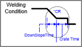

# 5.3.3. 펄스 용접 조건 – GE2 전용 설정

(1)	Pulse mode  
펄스 용접 사용여부를 설정합니다.

(2)	Pulse type : Hybrid/Soft/Hard  
펄스 용접의 종류를 설정합니다.

(3)	Initial peak current  
용접 초기 조건에서 펄스 용접의 피크 전류를 설정합니다.

(4)	Initial base current  
용접 초기 조건에서 펄스 용접의 베이스 전류를 설정합니다.

(5)	Pulse peak current (IP)  
본 펄스 용접의 피크 전류를 설정합니다.

(6)	Pulse base current 1 (IB1)  
본 펄스 용접의 베이스 전류 1을 설정합니다.

(7)	Pulse base current 2 (IB2)  
본 펄스 용접의 베이스 전류 2를 설정합니다.

(8)	Pulse peak rising (Ipr)  
펄스 용접 전류 상승을 설정합니다.

(9)	Pulse peak falling (Ipf)  
펄스 용접 전류 하강을 설정합니다.

(10)	Pulse rising time (Tipr)  
펄스 용접 전류 상승시간을 설정합니다.

(11)	Pulse peak time (Tip)  
펄스 용접 시 피크 전류를 유지하는 시간을 설정합니다.

(12)	Pulse falling time (Tipf)  
펄스 용접 전류 하강시간을 설정합니다.

(13)	Pulse frequency   
펄스 용접의 주파수를 설정합니다.

 </img>
 <em>
그림 5.6 GE2 펄스 파형 요소
</em>

