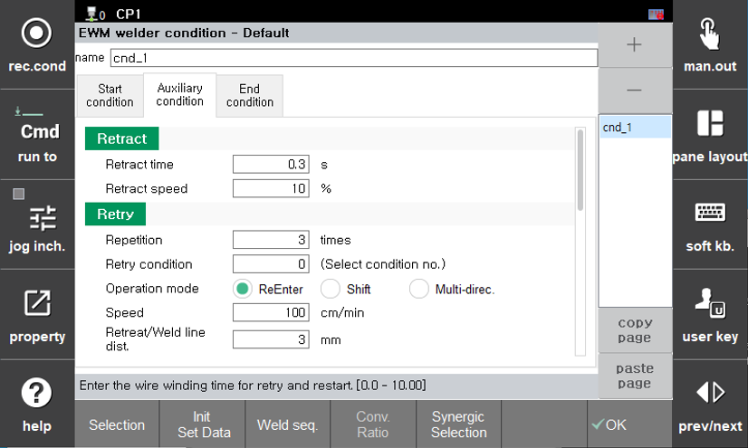
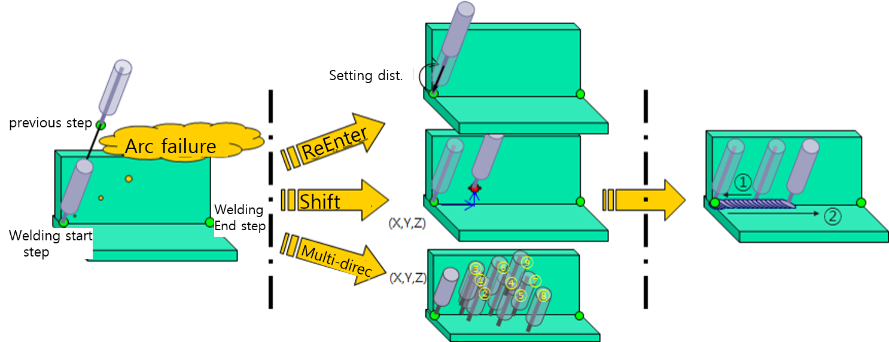

# 5.5.1 Welding Auxiliary condition – Retry

There may be cases where the arc does not ignite due to foreign materials attached near the weld start point of the base material when starting arc welding. The retry function automatically attempts to reignite the arc in such cases of arc ignition failure, enabling continuous operation without robot stoppage.

  

 </img>
 <em>
Figure 5.5.1. Welding Auxiliary condition (Retry) Setting(e.g. EWM)
</em>


[Note]   
The retry function is activated when arc ignition fails after an attempt, while the restart function is activated when welding is interrupted during arc welding and needs to be resumed.


The left section of [Figure 5.5.1] represents the retry conditions in the welding auxiliary conditions. The descriptions for each item of the retry conditions are as follows:  

### (1)	Retract Time: [0.3] second (Range: 0.00 ~ 10.00)  
  The retry function is performed after attempting to weld by feeding the wire and failing to ignite the arc. As a result, the wire may be excessively fed during the retry process. In this case, the wire might contact the base material and cause fusion or get too close to the base material, resulting in unstable arc ignition. To address this, the function supports retracting the wire before the retry to create an optimal environment for welding. This setting specifies the time for retracting the wire. If this value is not 0, the wire will be retracted, the torch will move, and then the arc ignition will be attempted.  

### (2)	Retract speed: [10] % (Range: 0.0 ~ 100.0)  
  Specifies the speed at which the wire is retracted during the retry process. This feature may not be supported depending on the welder model. (e.g. Saprom welders)  

### (3)	Repetition: [5] times (Range: 0 ~ 9)  
  Specifies the number of times the arc ignition will be retried after failure. If the arc fails to ignite within the specified number of retries, the system will return to the origin(the initial arc ignition attempt point, or the weld start point) and stop.  

### (4)	Retry condition: [0] (Range: 0 ~ 32)  
  Specifies the welding condition number to be used for retrying the arc ignition. During the retry, welding will be performed according to the conditions (current, voltage, etc.) of the welding start condition that was entered.
  However, if the entered condition number is "0" or if the operation mode is set to reentry, the welding will be perfomed based on the main condition of the currently active welding start condition.  

### (5)	Operation mode: ReEnter / Shift / Multi-direc.  
  Sets the method for moving the torch during a retry. Three different methods are supported, and the torch movement for each setting is as follows: (Please refer to [Figure 5.5.2])  

- A. ReEnter  
  When arc ignition fails, the torch steps backward to the previous step and attempts to ignitie the arc again. The distance of this backward movement is set in the welding auxiliary condition retry settings menu under the "Retreat/Weld line dist". After stepping back a certain distance, the torch will step forward again, so the voltage/current conditions follow the welding start conditions.  

- B. Shift  
  After moving by the shift distance set in the retry conditions of the welding auxiliary condition, the torch returns to the arc ignition step. The shift distance can be set in the forward/backward, left/right, and up/down direction relative to the welding line. During the retry, the welding conditions follow the welding start conditions in the retry settings. If arc ignition is successful, the arc is maintained, and the torch moves to the welding start point at the set speed, where welding proceeds.  

- C. Multi-direc.  
  In the retry conditions of the welding auxiliary settings, the "shift Distance" is devided into forward/backward, left/right, and up/down movements. The 1st retry attempts to move along the welding line by the forward/backward distance. The 2nd retry attempts the left/right and up/down movements, considering the distances set for those directions. The 3rd retry moves in the opposite direction of the left/right position from the second retry. For retries 4-6, the same operation is performed at twice the distance compared to retries 1-3, and for retries 7-9, the same operation is performed at three times the distance. Welding starts according to the welding start conditions in the retry settings, and if arc ignition is successful, the arc is maintained, and the torch moves to the welding start point at the set speed, where welding proceeds.  

### (6)	Speed: [100]cm/min (Range: 1.0 ~ 999.0)  
  Specifies the speed at which the torch moves to the retry position or returns to the welding start point during the retry.  

### (7)	Retreat/Weld line dist.: [3] mm (Range: 0.00 ~ 99.99)   
  When the operation mode is set to ReEnter, this is the distance the torch moves during the retry.  

### (8)	Shift distance: FWD/BWD = [ 2 ], L/R = [ 2 ], Up/Down = [ 1 ] mm (Range: -99.99 ~ 99.99)  
  When the operation mode is set to Shift, this is the distance the torch moves during the retry.  
    

 </img>
 <em>
Figure 5.5.2 Retry Function Sequence
</em>

