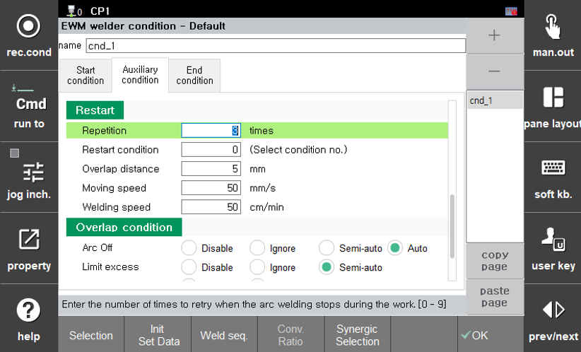
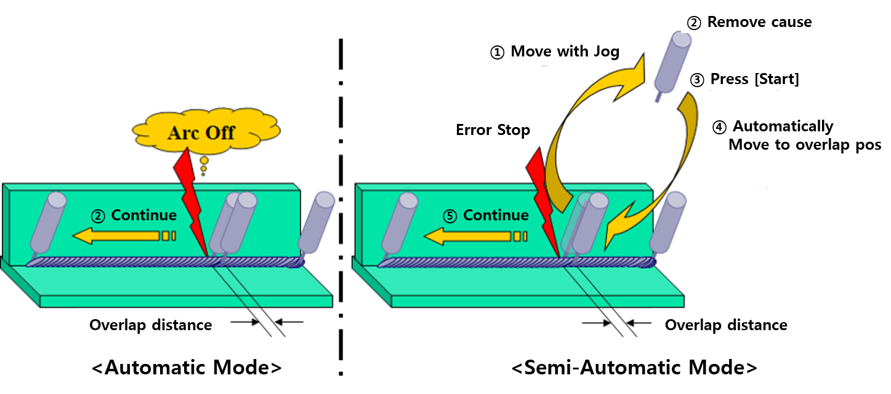

# 5.5.2 용접 보조 조건 - 재기동  

During arc welding, the process may be interrupted due to factors such as arc failure, exceeding the limits of welding current and voltage, gas pressure drop, wire shortage, cooling water errors, etc.
When welding is restarted from the point where the process was interrupted, there is a risk of leaving un-welded areas.
In such cases, the restart function compensates for the un-welded sections by performing overlap welding.

After welding is interrupted, the system automatically restarts or, after eliminating the cause of the interruption, resumes operation.
It moves backward along the weld line for a certain distance and then resumes welding. This results in an overlap region near the point where welding was stopped, preventing un-welded areas from being created.

This section describes the restart conditions and overlap settings.

 
 
*Figure 5.5.3. Welding Auxiliary condition (Restart) Setting(e.g. EWM)*

### (1)	Restart Repetition: [ 3 ] times (Range: 0 ~ 9)   
Specifies the maximum number of restart attempts within the same welding section. If this count is exceeded, the error "**E1274 Re-startup count exceeded within the same welding section**" will occur.  

### (2)	Restart Condition: [ 0 ] (Range: 0 ~ 32)   
Specifies the welding condition number to be used during the overlap region when restarting the welding. The welding will be performed with the specified initial welding conditions(current, voltage, etc.)  
If the input condition number is "0", welding will proceed with the current welding start conditions from the point of overlap.

### (3)	Overlap distance: [ 5 ] mm (Range: 0.0 ~ 99.9)  
Specifies the length of the overlap (overlap distance) when restarting the welidng. The robot will move back by the specified distance and then resume welding.  

### (4)	Moving Speed: [ 50 ] mm/sec (Range: 1~999)  
Specifies the speed at which the torch is moved to the overlap start position.
This corresponds to the movement speed in the section from ③ to ④ in [figure 5.5.4]  

### (5)	Welding Speed: [ 50 ] cm/min (Range: 1~999)  
Specifies the robot's speed while performing overlap welding from the start to the end position. This is the speed during the overlap region in section ④ of [Figure 5.5.4].

When an error occurs during welding from the start point to the end point (⑤), and if the overlap condition is semi-automatic, the user must identify the cause of the welding stop and address the error (①).
After resolving the issue (②), pressing the `Start` button (③) will resume welding.
The robot will automatically move to the overlap start position at the speed set by the `Moving speed` (④).
Once at the position, it will perform overlap welding at the `Welding speed` for the specified distance, and then continue welding at the normal speed.
However, if an error occurs during the overlap welding, the robot will not repeat the overlap but will directly start welding from that point onward.

---

 
*Figure 5.5.4. Restart Function Sequence*

### (6)	Overlap Condition Settings  
The lower section of [Figure 5.5.3] defines how to perform overlap welding when the welding process is interrupted due to reasons such as Arc Off (arc failure), exceeding limits, Gas Off (gas pressure drop), Wire Off (wire shortage), or Coolant Off (coolant error) during arc welding.
    
-  A. Auto  
    This setting performs overlap automatically. It can only be configured if welding has been interrupted due to arc stoppage.
    In the event of an arc stoppage during welding, the process does not stop. Instead, overlap welding is carried out based on the method set in the restart section of the welding auxiliary conditions, after which the main process resumes.
    However, if the arc stops again during the overlap welding section, welding will resume from that position immediately.  

- B. Semi-Auto  
    This setting allows the user to perform overlap manually. If issues such as Arc Off, exceeding limits, gas pressure drop, wire shortage, or coolant error occur, welding is interrupted, ant the robot is also halted.
    After addressing the cause, the user must press `Start`, upon which overlap welding will be performed based on the method set in the restart section of the welding auxiliary conditions, and then main process resumes.
    At this point, if the robot is moved to a different location using the jog function and `Start` is pressed, it will move directly to the overlap welding position and resume welding.

- C. Ignore  
    This setting ignores errors. When this setting is enabled, the robot continues the process without stopping even if welding is interrupted. In other words, the process will proceed regardless of arc stoppage or exceeding the set limits.
    This method can only be applied when welding has been interrupted due to arc stoppage or exceeding limits, and the process is being restarted.

- D. Disable  
    This setting prohibits overlap welding. If issus such as arc stoppage, exceeding limits, gas pressure drop, wire shortage, or coolant error occur, welding is interrupted and the robot is halted.
    After addressing the cause, the user must press `Start`, overlap welding will not be performed, and welding will begin from the position where the robot was stopped.


  When moving the robot, pressing the step forward/backward keys will reset the restart information, prventing overlap overlap from being performed. Only jog movements should be used to move the robot.


