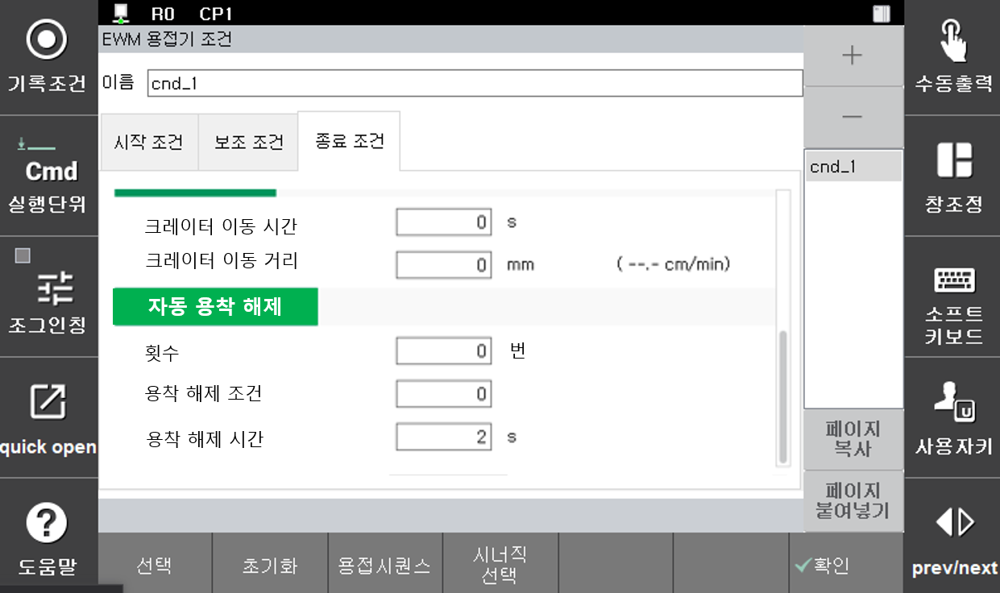

# 5.5.3 焊接辅助条件 - 焊条释放

在弧焊结束时，可能会发生焊丝与母材熔合的情况。为了防止这种现象，焊接机在焊接结束时会暂时提高电压进行熔合防止处理。虽然焊接机在进行熔合防止处理后仍可能发生熔合，因此机器人控制器也会在焊接后将熔合检查信号发送给焊接机以确认熔合的状态。  
自动熔合释放功能是在焊接后检测到熔合时自动执行熔合释放，以便机器人不停止而能够连续作业的功能。使用此功能时，当检测到熔合时，会立即施加一定电压，自动进行熔合释放处理。自动熔合释放尝试会根据设置的次数进行重复，当超过设定的次数而熔合未释放时，将输出“熔合中”信号，机器人将停止。

弧焊设置为数字时，在`[焊接开始条件] - [焊接结束条件]`对话框中按下`辅助条件`键，会出现如下的自动熔合释放设置界面。

 
*图 5.5.4 自动熔合释放设置*

 

自动熔合释放条件的各项内容如下所示。

### (1) 次数: [2] 次 (范围: 0 ~ 9次)  
熔合释放处理的最大重复次数。如果在设定次数内未释放熔合，将会发生熔合错误（“**E1262 焊丝粘连检测中**”）。特别地，若设置为0，将不进行熔合检查，直接移动到下一步。

### (2) 熔合释放条件: [0] (范围 : 0 ~ 32)  
进行熔合释放处理时所使用的焊接条件的编号。若输入的条件编号为“0”，则将根据当前正在执行的焊接开始条件的本条件进行熔合释放。

### (3) 条件保持时间: [2] 秒 (范围 : 0.00 ~ 10.0)  
保持熔合释放条件输出的时间。如果时间过短，则不会释放熔合。