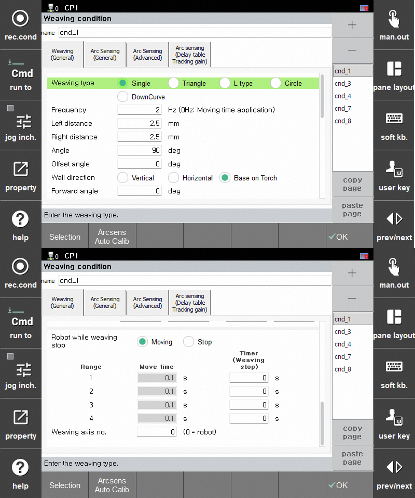

# 6.1.1 Weaving Condition

When the cursor is placed above the `weaving ...` command, pressing the [**property**] key will display the weaving condition editing screen as shown below.  

 </img>
 <em>
Figure 6.1.1. Weaving Condition Settings
</em>

---

The details for each field in the weaving conditions are as follows:  

### (1)	Condition Number: [1] (Range: 1 ~ 1000)  

This is the condition number where the weaving operation settings are stored.
Conditions can be added or removed by pressing the [+] or [-] buttons.
You can navigate to the previous or next condition number to edit the corresponding condition.

### (2)	Weaving Type: <Single, Triangle, L type, Circle, DownCurve>  

This field specifies the type of weaving motion. (please refer to [[6.1.2 Weaving Type]](../1_Weaving_function/2_configuration_.md))

### (3)	Frequency: [2] Hz (Range: 0.0 ~ 10.0)  

This field sets the weaving frequency, with a range of `0.0 to 10.0 Hz`. When the frequency is set to '0', the movement time will be applied instead.  
(please refer to [[6.1.3 Frequency]](../1_Weaving_function/3_frequency.md))  

### (4)	Default Pattern  

This field sets the pattern for the weaving motion.
(please refer to [[6.1.4 Default Pattern]](../1_Weaving_function/4_pattern.md))  

- **Left Distance(Wall Direction Distance)** : [2.5] mm (Range: 1.0 ~ 25.0)
- **Right Distance(Other Direction Distance)** : [2.5] mm (Range: 1.0 ~ 25.0)
- **Angle** : [90] degrees (Range: 0.1 ~ 180.0)
- **Offset Angle** : When the torch orientation reference is used, the field specifies the angle at which the tilts to the left or right from its position.
- **Wall Direaction** : <**Vertical**, **Horizon**, **Base on Torch**>

### (5) Forward Angle: [0] degrees (Range : -90.0 ~ 90.0)  

This field indicates the weaving angle relative to the forward direction.
When set to 0 degrees, the forward and weaving directions form a right angle.  
(please refer to [[6.1.4 Default Pattern]](../1_Weaving_function/4_pattern.md))  

### (6)	Boundary Limitation: <Enable, Disable>  

This option determines whether the weaving trajectory is restricted by the boundaries at the start and end of the welding section. When this function is enabled, the weaving trajectory is confined within the welding area.  
(please refer to [[6.1.4 Default Pattern]](../1_Weaving_function/4_pattern.md))  

### (7)	Robot Behavior when Weaving Stops: <Moving, Stop>

When a timer is set in the weaving pattern, the weaving motion will stop at both the left and right ends of the weaving.
In this case, this setting determines whether the robot continues to move or stops during the weaving stop period.  

### (8) Move Time: [1] sec (Range: 0.0 ~ 10.0), Timer(Weaving Stop): [0] (범위 : 0.00 ~ 2.00)  

If the weaving frequency is set to '0', the weaving motion will be performed based on the move time.
In this case, the move time for each section and the weaving stop time between sections are configured.  
(please refer to [[6.1.5 Weaving Section Setting]](../1_Weaving_function/5_weaving_section.md))  

When the 'Weaving Frequency' is set, only the 'Timer (Weaving Stop)' setting can be adjusted.
Druing the total time set for the specified frequency, the robot performs weaving for the duration excluding the time set in the 'Timer (Weaving Stop)'. During the weaving stop time, weaving stops.
Whether the robot continues to move during the weaving stop time is determined by the setting of 'Robot Behavior when Weaving Stops'.

### (9) Weaving Axis Number: [1]  

This setting determines whether the part perfoming the weaving motion is the robot or an auxiliary axis.
When set to an auxiliary axis, the robot will move as recorded, and only the auxiliary axis will move according to the set distance and frequency to implement weaving.
If an auxiliary axis is selected, the auxiliary axis specified in the 'Auxiliary Axis Number' field will perform the weaving motion.
