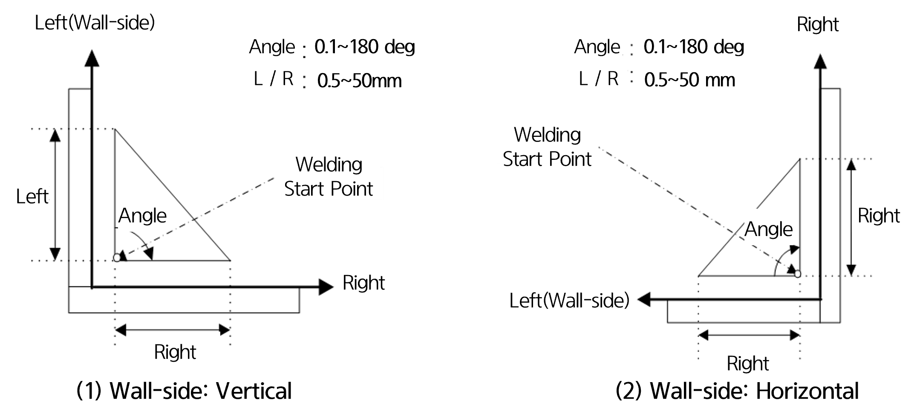
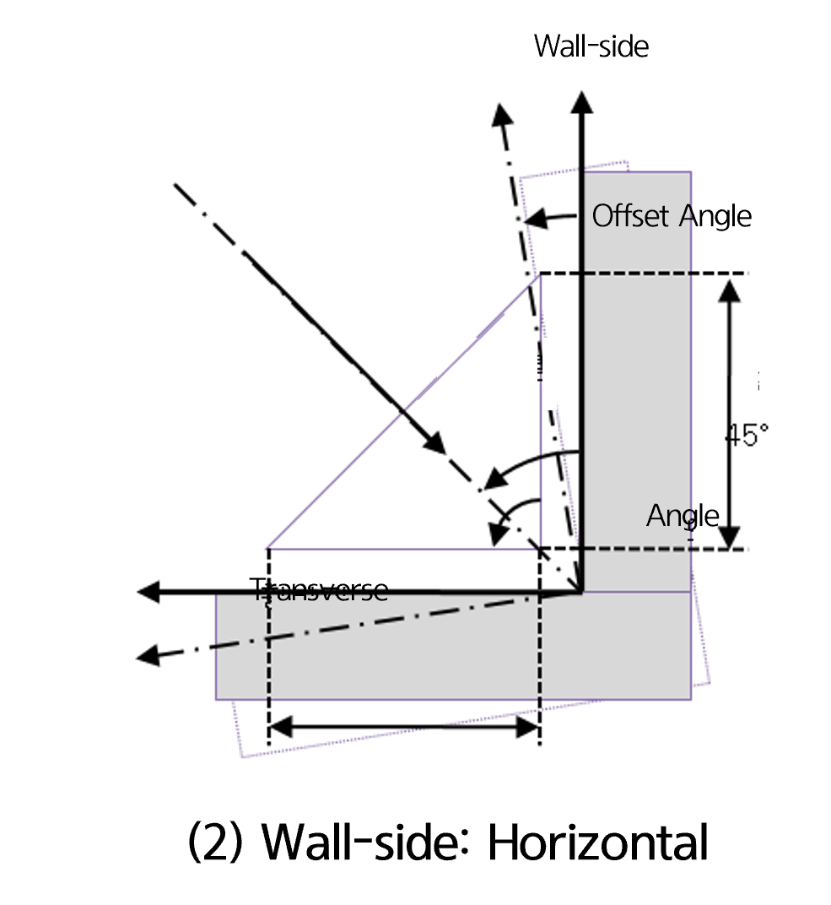
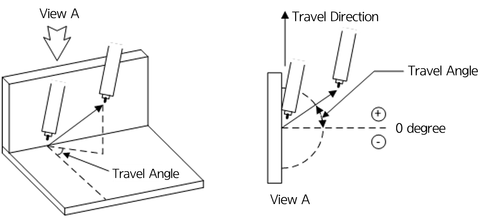
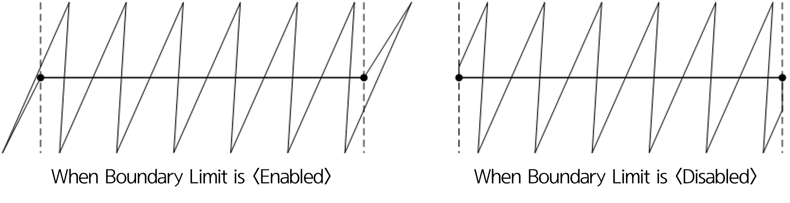

# 6.1.4 Default Pattern

다음 그림에서의 각 요소를 설정합니다. 
  

  </img>
  </img>
  <em>
그림 6.1.3 벽방향에 따른 위빙 요소
</em>

- **Left Distance(Wall Direction Distance)** : [2.5] mm (Range: 1.0 ~ 25.0)
- **Right Distance(Other Direction Distance)** : [2.5] mm (Range: 1.0 ~ 25.0)

### (1) Left Distance(Wall Direction Distance)

Set the distance in the left (wall) direction.  

### (2) Right Distance(Other Direction Distance)

Set the distance in the right direction.  

### (3)	Angle

As shown in Figure 6.3, set the angle between the left (wall) direction and the right direction.
The angle is measured from the left (wall) direction to the right direction.
However, when using **REFP 4**, this angle will be ignored.

### (4)	Offset Angle (refer to [Figure 6.1.3])

When the wall direction is set based on the torch posture, this setting defines the angle at which the weaving surface rotates relative to the direction of weaving progression (the dirction in Figure (3) marked with ⊙).
When set to 0°, the angle between the left (wall) direction and the right direction is bisected.

### (5) Wal Direction (refer to [Figure 6.1.3])

Set the left (wall) direction to one of the following options: vertical (Figure (1)), horizontal (Figure (2)), or torch posture-based (Figure (3))
Generally, the left (wall) direction is set to vertical, while the horizontal direction is typically used for weaving with a 180-degree angle on the plane.  

For torch posture-based weaving, the left (wall) direction is set counterclockwise from the direction of weaving progression (the dirction in Figure (3) marked with ⊙).
Torch posture-based weaving can accommodate all left (wall directions), and it can also adapt when the left (wall) direction changes during the weaving process.

### (6) Forward Angle

This refers to the angle of the weaving vibration direction relative to the welding line. The adjustable range is -90.0 to 90.0 degrees.
When set to 0°, the weaving will move perpendicular to the welding line.

 
*Figure 6.1.4. Weaving Forward Angle*

    
### (7)	Boundary Limitation

For weaving with a forward angle other than 0°, the weaving may exceed the boundary of the section at the start and end of the weaving area.  
The boundary limitation setting allows you to choose whether the weaving should be confined within the section boundaries or if it can proceed without any restrictions beyond the section boundaries.

 
 
*Figure 6.1.5 Weaving Boundary Limitation* 
