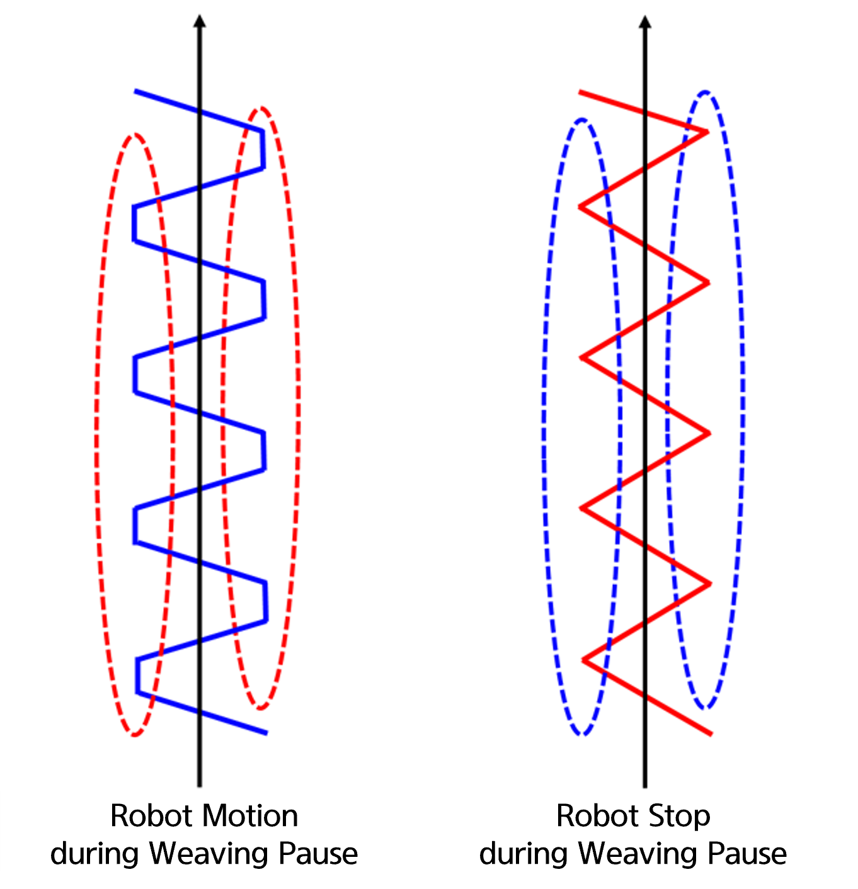
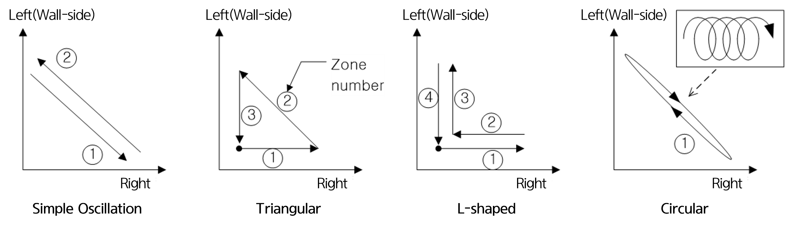
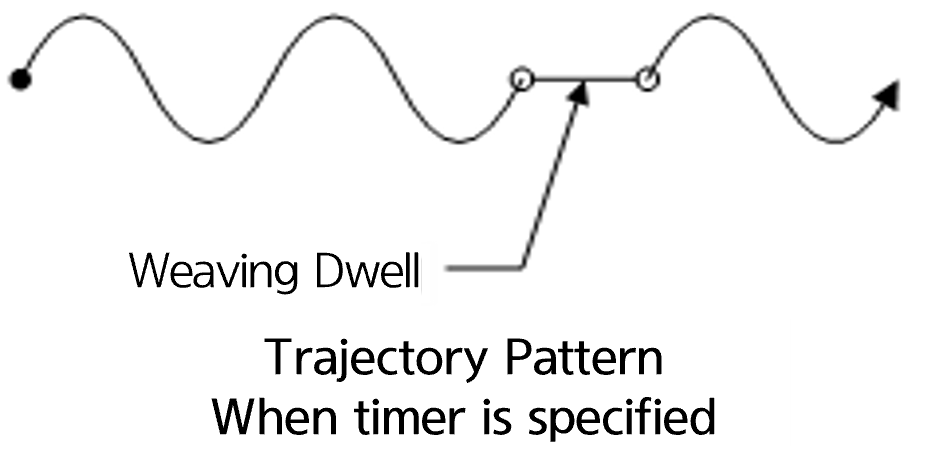

# 6.1.5 Weaving Section Setting

### (1)	Robot Behavior when Weaving Stops  

When the Timer (Weaving Stop) is set to a value other than 0, the weaving pattern will stop at the end of the weaving section for the specified duration.
In this state, you can configure whether the robot will continue to move or stop.

If set to **Move**, the robot behaves as shown on the left in the figure; if set to **Stop**, the behavior is as shown on the right.  

 
*Figure 6.1.6. Robot Behavior when Weaving Stops* 

### (2)	Move Time

This setting defines the move time for each section when "Frequency" is set to '0'.
The move time for unused sections (e.g., sections 3 and 4 in simple oscillation) will be ignored.

 
*Figure 6.1.7. Movement Section by Weaving Pattern* 

### (3)	Timer (Weaving Stop)

Set the weaving stop time at the endpoint of each section as shown in the figure below.
This setting also applies when the weaving frequency is configured.
When the weaving frequency is set, the robot's move time during the weaving cycle is calculated as follows:  
* Robot Move Time = (1 / Weaving Frequency) - Total Timer Time


  if "Robot Behavior when Weaving Stops" is set to **Move**, the movement trajectory does not stop, and it will follow a straight path, as shown in the figure below.

 
 
 
*Figure 6.1.8. Trajectory Example When Timer is Set*   


  if "Robot Behavior when Weaving Stops" is set to **Stop**, the movement trajectory also stops, but the robot's speed remains the same.
