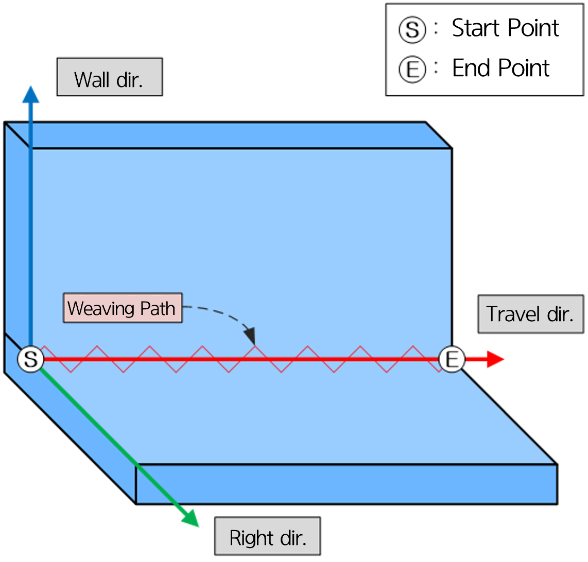
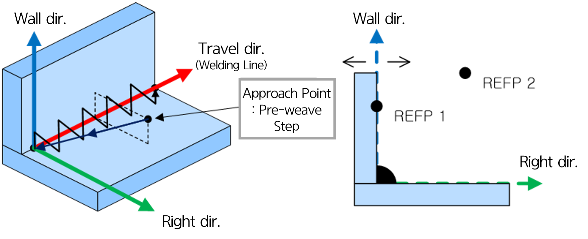
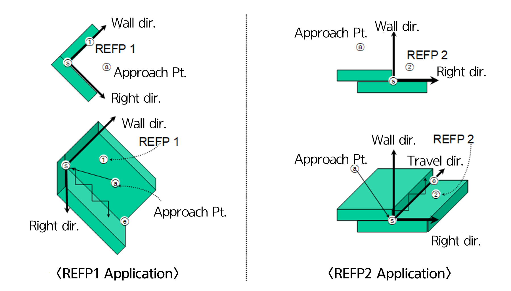
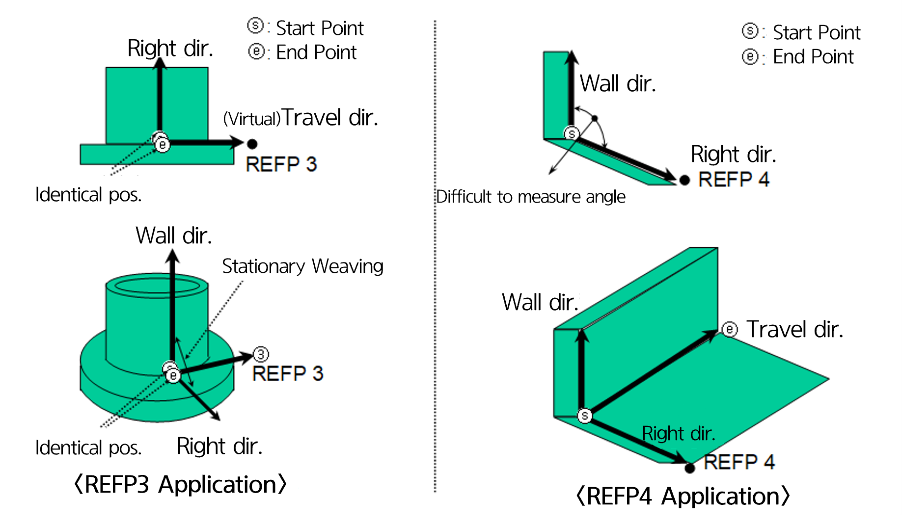

# 6.2.1 Reference Point Type

  </img>
  <em>
Figure 6.2.1. Weaving Coordinate System
</em>

 

### (1)	refp 1  

The `refp1` command specifies the wall direction of the weaving coordinate system.
If the wall direction is not specifically defined, the robot will use the vertical direction as the wall direction to perform the weaving opeartion.
Therefore, if the wall direction is not vertical, this command should be used to set the wall direction.  

* **Usage**: Record a point on the surface of the workpiece in the wall direction as `refp 1`.   This point and the welding seam(straight line ⓢⓔ) can be used to determine the wall direction.   If only the `refp1` command is used, the other direction will be set by rotating the wall direction by the default pattern angle relative to the direction of movement.

### (2)	refp 2  

The `refp2` command sets the side of the space when the weaving trajectory will be created, based on the plane that defines the wall direction.

* **Usage**: Record any point in the space on the side where weaving will be performed as `refp 2`.   [Figure 6.2.2] shows an example of the weaving coordinate system when `refp 2` is recorded between two base materials.   When only the `refp 2` command is used, the Z-axis of the robot's coordinate system is set to the wall direction, and the other direction is determined accordingly.

### (3)	refp 3  

The `refp3` command specifies the direction of weaving in a stationary weaving operation, where the robot remains stationary and only the positioner rotates.  

* **Usage**: Record any point along a straight line that indicates the direction of movement, starting from the robot's stationary position, as `refp 3`.   The robot will weave along a direction perpendicular to the line formed by the welding start point and `refp 3`. 

* Example: After setting refp3, specify the same positions for the welding start and end steps. The travel speed is set by time.   (Note: If `refp 3` is not specified, no weaving will occur, and an error will be triggered.)

### (4)	refp 4  

The `refp 4` command sets the angle between the wall direction and the other direction.
[Figure 6.2.3.] shows an example when the angle is set to 90 degrees.
When using this command to specify the angle, the value set in `Angle` will be ignored.

    

  </img>
  <em>
Figure 6.2.2. Weaving Direction and Reference Point
</em>

 
    

  </img>
  </img>
  <em>
Figure 6.2.3. Usage of Different Reference Points
</em>

   


  - refp 1: Ensure the distance from the welding seam is at least 5mm.
  - refp 2: Ensure the distance from the wall direction plane is at least 5mm.
  - refp 3: Ensure the distance from the start point is at least 5mm.
  - refp 4: Set the angle when it is difficult to measure the angle of the weaving pattern.
