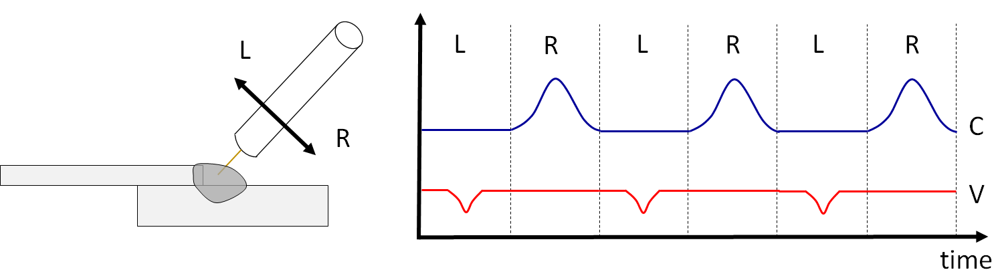

# 6.3 Weav sync out 기능

위빙 시 좌측, 우측에서 전류, 전압 등을 각각 설정하여 부드럽게 입열량(용착량)을 조절할 수 있는 기능입니다.


본 기능은 60.30-00 버전부터 지원합니다.


 </img>
 <em>
그림. Weav sync out 기능 동작 예
</em>

   

위 그림과 같이 좌우 위빙에서 입열량, 용착량을 조절할 필요가 있는 경우 또는 비드의 모양을 다르게 만들어야 할 경우 사용합니다.

weaving 명령어의 [속성]창에 진입하여 다음 항목을 설정하여 사용할 수 있습니다.

 </img>
 <em>
그림. Weav sync out 기능 설정
</em>

   

<table>
  <thead>
    <tr>
      <th style="text-align:left">항목</th>
      <th style="text-align:left">설명</th>
    </tr>
  </thead>
  <tbody>
    <tr>
      <td style="text-align:left">사용여부</td>
      <td style="text-align:left">
      유효로 두면 위빙시 전류/전압을 사용자가 설정한대로 전류/전압 출력을 조절합니다.
      </td>
    </tr>
    <tr>
      <td style="text-align:left">Range</td>
      <td style="text-align:left">
      좌측, 우측 위빙 중 몇 %의 범위를 출력 변화시킬 것인지 설정합니다.
      </td>
    </tr>
    <tr>
      <td style="text-align:left">Output</td>
      <td style="text-align:left">
        left/right : 좌측, 우측 위빙 설정범위 내에서 변화시킬 본조건 대비 전류,전압 출력량 [%]
      </td>
    </tr>
  </tbody>
</table>