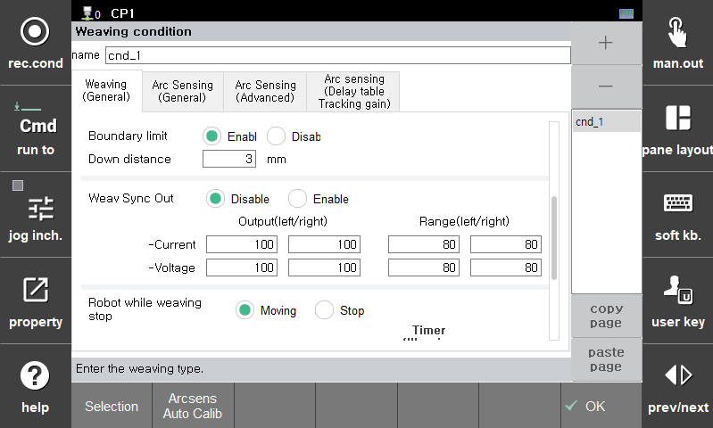

# 6.3 Weaving Sync Out

This feature allows for smooth control of heat input (weld deposit) by adjusting the current and voltage on the left and right sides during weaving.  


  The functionality is supported from version 60.30-00.
  

  </img>
  <em>
그림 6.3.1. Example of Weaving Sync Output Function
</em>

   

As shown in the figure above, this feature is used when it is necessary to control the heat input and weld deposit during left and right weaving, or when the bead shape needs to be adjusted.

To use this feature, enter the `[Property] window of the `weaving` command and configure the following settings.

  </img>
  <em>
Figure 6.3.2. Weaving Sync Output Function Settings
</em>

   

<table>
  <thead>
    <tr>
      <th style="text-align:left">Item</th>
      <th style="text-align:left">Description</th>
    </tr>
  </thead>
  <tbody>
    <tr>
      <td style="text-align:left">Enable</td>
      <td style="text-align:left">
        When enabled, it adjusts the current/voltage output during weaving according to the user's settings.
      </td>
    </tr>
    <tr>
      <td style="text-align:left">Output(left/right)</td>
      <td style="text-align:left">
        The percentage of curren/voltage output change relative to the baseline condition within the left and right weaving settings
      </td>
    </tr>
    <tr>
      <td style="text-align:left">Range</td>
      <td style="text-align:left">
        Set the percentage range of output change during the left and right weaving.
      </td>
    </tr>
  </tbody>
</table>