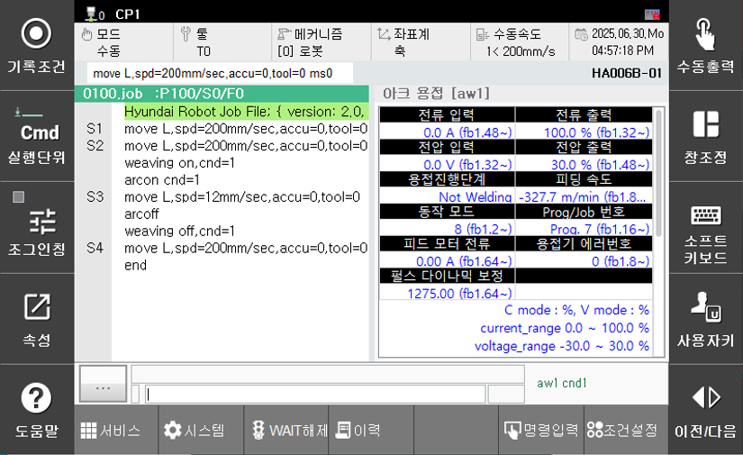

# 7.1.1 Detailed Information Monitoring

This function allows you to check detailed data related to arc welding. The information provided may vary depending on the set welder, so the monitoring window may differ based on the configured welder. If a communication error occurs with the welder or if there is no communication connection, the "Welder Error Code" or "Welder Communication Status" items will be displayed with a red background. The following data can be monitored in the detailed information monitoring.

 </img>
 <em>
Figure 7.1.1. Arc Welding Detailed Information Monitoring
</em>

1. Current Input: The commanded welding current sent from the robot to the welder (A)

2. Current Output: The actual welding current currently being output by the welder (A)

3. Voltage Iutput: The commanded welding voltage sent from the robot to the welder (V)

4. Voltage Output: The actual welding voltage currently being output by the welder (V)

5. Welding Process

6. Feeding Speed: The wire feeding speed (m/min)

7. Operation Mode: Arc welding mode

8. Prog/Job Number

9. Feed Motor Current: The current driving the actual fedding motor (A)

10. Welder Error Number

11. Pulse Dynamic Compensation

12. Additional Information Window: This section displays useful additional information such as the upper and lower limits of current/voltage and their units. 

13. Input Signals: Signals sent from the welder to the robot controller.(Can be checked under `[F2: System] - 5: Initialization - 3: Usage Setting - Welder Setting - Input signal assign`)

14. Output Signals: Signals sent from the robot controller to the welder.(Can be checked under `[F2: System] - 5: Initialization - 3: Usage Setting - Welder Setting - Output signal assign`)

15. Command Values: Frequently used commands that can be manually output.

