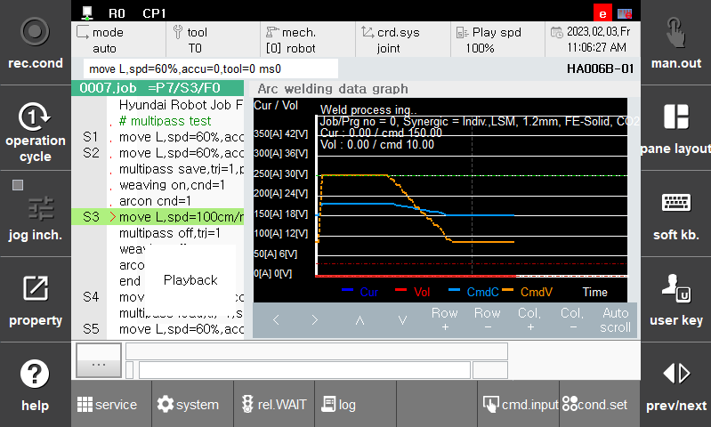

# 7.1.2 Arc welding data graph

Arc welding data graph displays information related to the welding data's waveform, allowing you to view not only the real-time data but also past data at a glance.

To use this feature, on TP, press `[pane layout] - select - arc data graph` sequentially. 

 

 </img>
 <em>
Figure 7.1.2. Arc Welding data graph
</em>

The following items can be checked in the monitoring window:

1. Welding Status(initial conditions, gas pre-flow, end conditions, gas post-flow, crater movement, main welding, etc.)

2. Job/Prog no, Synergic settings

3. Input Current / Command current graph

4. Input voltage / Command voltage graph

5. Moving average filtered graph of input current and voltage

6. Upper and lower limits of welding current and voltage

Arc Welding data graph offers left/right and up/down movement functions. You can also add rows and columns to view more data. By toggling the [**Auto scroll**] button, you can review the past welding screens even during the current welding process.

You can increase the number of rows in the graph by pressing the **[Row]** or **[Col]** button at the bottom of the arc welding data graph screen. If you want to zoom in on the data graph further, you can press **[SHIFT] + [Row]** or **[SHIFT] + [Col]** to enlarge the display.