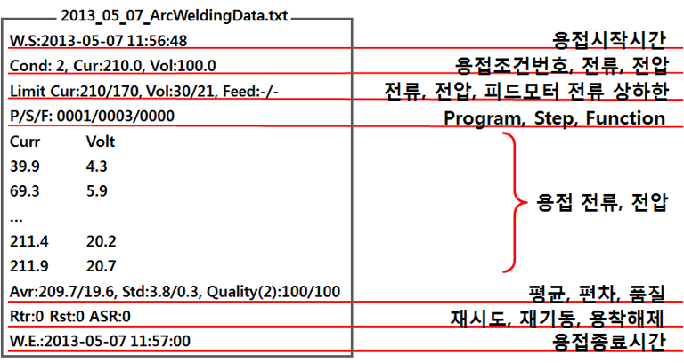
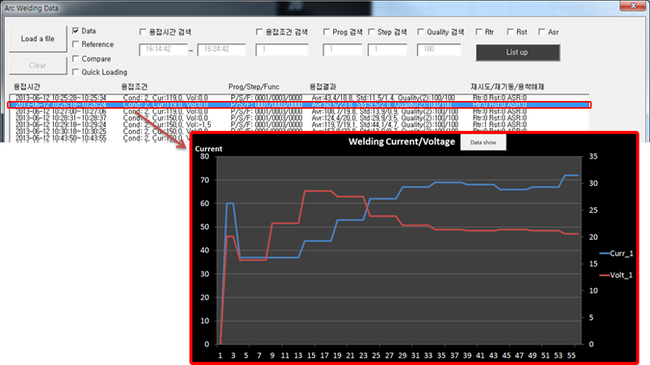

# 7.2 자동 Arc 용접 데이터 저장

본 기능은 자동으로 Arc 용접 데이터를 텍스트 파일로 저장하는 기능입니다. Arc 용접의 이력을 관리하거나 과거 데이터를 확인할 때 유용하게 사용되는 기능입니다. 기능을 활성화 하기 위해서는 『시스템』 → 『4: 응용 파라미터』 → 『2: 아크용접』 → 『18: 용접 중 용접 데이터 저장』을 유효로 설정해야 합니다.

자동으로 저장되는 데이터는 용접기가 보내는 전류/전압뿐만 아니라 용접시작/종료시간, 조건 등의 부가정보와 평균, 편차, 정량화 결과 등의 통계 데이터를 저장합니다. ARCON 명령어부터 Arc가 사라질 때까지를 1회 용접으로 간주하며, 매회 아래 그림과 같은 형식으로 데이터를 저장합니다. 저장되는 통계 데이터는 모두 1회 용접에 해당하는 값입니다. 저장되는 데이터의 종류는 아래 그림과 같습니다.

 

 </img>
 <em>
그림 7.5 저장된 Arc 용접 데이터
</em>

저장 파일은 하루에 한 개씩 텍스트 파일로 티칭 펜던트의 특정 폴더에 저장이 됩니다 (ResidentFlash\bin\ArcWeldingData). 파일 이름은 yyyy_mm_dd.ArcWeldingData.txt입니다. 해당 파일의 이름을 변경할 경우 당사에서 제공하는 용접 데이터 확인 프로그램의 사용이 불가할 수 있으므로 파일의 기본 명칭을 유지하는 것을 권장합니다. 

티칭 펜던트의 저장 용량에 한계가 있기 때문에 티칭 펜던트에 남은 저장 용량이 많지 않을 경우 오래된 파일부터 자동으로 삭제합니다. 그리고 오래된 저장 파일이 있을 경우에 해당 파일을 자동으로 삭제됩니다. 그러므로 Arc 용접 이력을 오랜 기간 저장하기 위해서는 주기적으로 데이터를 받아 저장하는 것을 권장합니다.

 
저장된 용접 데이터는 파일에 문자로 저장되기 때문에 저장 후 원하는 용접 데이터를 찾고 해당 용접 데이터를 한 눈에 보는 것이 쉽지 않습니다. 이러한 불편함을 해소하기 위해 당사에서는 아래 2가지 방법으로 원하는 용접 데이터를 쉽게 찾고, 찾은 데이터를 한 눈에 파악할 수 있도록 합니다.

- (1) PC용 Arc 용접 데이터 확인 프로그램
- (2) Arc 용접 데이터 관리기능(티칭 펜던트용, 7.3 Arc 용접 데이터 관리 기능 참고)

PC용 Arc 용접 데이터 확인 프로그램은 엑셀을 이용하여 사용자가 백업한 파일을 PC나 노트북에서 손쉽게 확인할 수 있도록 합니다. 해당 프로그램에서 원하는 용접 파일을 선택 후 용접시간, 용접조건, 프로그램, 스텝 등의 검색조건으로 원하는 용접을 검색할 수 있습니다. 또한 검색된 용접을 그래프로 가시화 하여 쉽게 직관적으로 확인할 수 있도록 지원합니다. 또한 용접 데이터를 비교하여 그려주는 기능으로 과거의 데이터를 서로 비교할 수 있습니다.
 

 </img>
 <em>
그림 7.6 PC용 Arc 용접 데이터 확인 프로그램
</em>

해당 프로그램의 사용을 위해서는 당사에 문의하시기 바랍니다. 또한 PC용 Arc 용접 데이터 확인 프로그램 사용법은 매뉴얼 마지막의 부록을 참고하시기 바랍니다.
