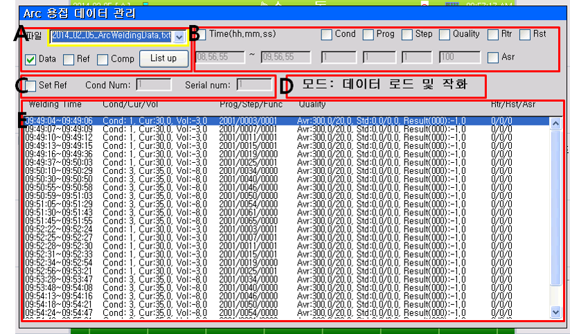

# 7.3 Arc 용접 데이터 관리 기능

본 기능은 자동으로 저장된 Arc 용접 데이터 파일을 티칭 펜던트로 불러와 원하는 용접 데이터를 검색하고 그래프로 보여줄 수 있도록 지원합니다. 또한 [[7.4 Arc 용접 데이터 정량화 기능]](../4_Result_quantification/README.md)에서 사용될 기준 데이터를 설정할 수 있도록 지원합니다. 본 기능을 사용하기 위해서는 1개 이상의 용접 데이터 저장파일이 티칭 펜던트에 있어야 합니다.
본 기능을 사용하기 위해서는 아래 그림과 같이 모니터링 창을 Arc 용접 파형 모니터링으로 설정한 후 수동모드에서 [데이터 관리]를 누르면 Arc 용접 데이터 관리 대화상자가 나옵니다.

 

그림 7.7 Arc 용접 데이터 관리 기능 진입 화면

 
Arc 용접 데이터 관리 대화상자는 아래 그림과 같이 구성되어 있습니다. A는 불러올 파일의 종류를 결정하고 파일의 목록을 보여줍니다. B는 용접 데이터 검색을 위한 조건을 입력하는 화면입니다. C는 Arc 용접 정량화 기능에 사용될 기준 파일을 저장하기 위한 화면입니다. D는 현재 설정 모드에 대한 설명입니다. E는 불러온 파일에 저장되어 있는 용접 데이터 목록입니다.

 </img>
 <em>
그림 7.8 Arc 용접 데이터 관리 기능 진입 화면
</em>

