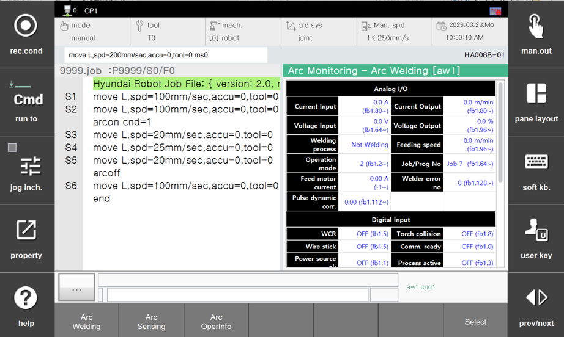
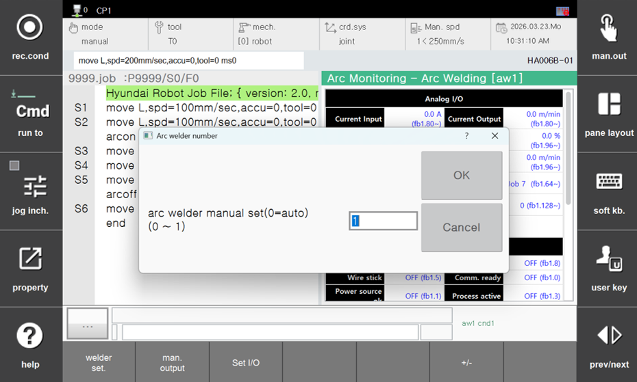
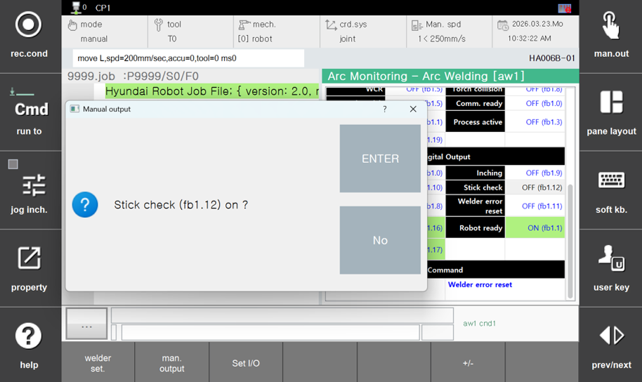
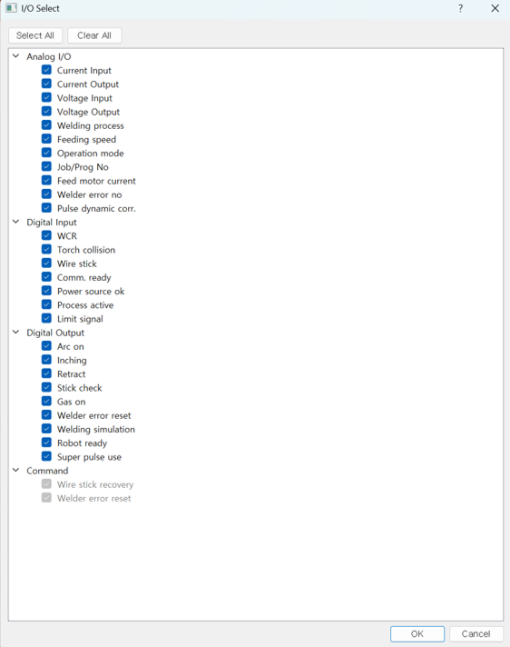

# 7.4.1 Arc Welding

When entering the "Arc Monitoring" screen for the first time, this screen is displayed by default.
To switch to this screen from another screen, click `[F1: Arc Welding]` on the bottom panel.
This screen displays the analog and digital signals exchanged with the welder.

 
*Figure 7.4.1.1. Arc Welding Monitoring*  

On the "Arc Welding" screen, click the `[F7: Select]` button on the bottom panel to change the panel contents and access the following functions:  

### (1) Welder set.

 
*Figure 7.4.1.2. Manual Welder Setup*  

Click the `[F1: welder set.]` button on the bottom panel to open the following window.
In this window, you can manually configure the welding machine.

### (2) Manual Output

 
*Figure 7.4.1.3. Manual Output*  

Select the desired signal from either the analog output singals or digital output signals(e.g. "Stick Check" or "OFF (fb1.12)" as shown in the figure), and then click the `[F2: Manual Output]` button on the bottom panel.
A window will appear where you can configure the selected signal to be output.  

### (3) I/O Setup

A wide variety of data is exchanged between the robot controller and the welder in the form of analog and digital signals(refer to `[F2: System] - 5: Initialization - 3: Usage setting - [F2: Welder setting]`).
However, the signals that operators need to monitor are typically limited.
Click the `[F3: Set I/O]` button on the bottom panel to open the following window.  

 
*Figure 7.4.1.4. I/O Output Setup*  

This window displays all signals exchanged between the robot controller and the welder.
Select only the required data and click to `OK` to monitor the selected signals only.
You can also use the `Select All` or `Clear All` buttons at the top to enable or disable all items at once.  
