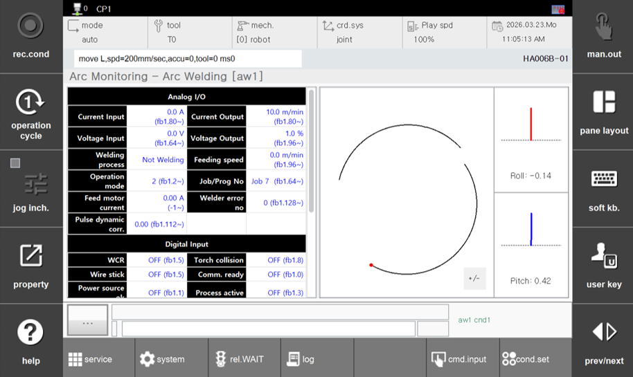

# 7.4.4 弧轨迹监测

要使用此功能，首先导航到 `[F2: 系统] - 4: 应用参数 - 2: 弧焊 ([F2: System] - 4: Application parameter - 2: Arc welding)` 并将 **"Arc Trajectory monitoring"** 设置为 **"Enable"**。
左侧显示从底部面板中选择的表格数据，右侧显示 "Arc Trajectory Monitoring" 屏幕。
此屏幕提供了弧焊过程中焊接轨迹和焊枪姿态（工作角度和推拉角度）的实时可视化。  
（您可以实时监控 `arcon` 到 `arcoff` 的轨迹和焊接信息）

 
*图 7.4.4.1. 弧轨迹监测*  

您可以通过点击并拖动中间分隔符来调整表格和画布的大小。
（然而，一个视图不能完全覆盖另一个视图。如果屏幕最小化后再恢复到全屏，布局将被重置）
使用 `+/-` 键与 `[shift]` 键一起放大或缩小。  
在画布内，您可以拖动以调整视图位置。  