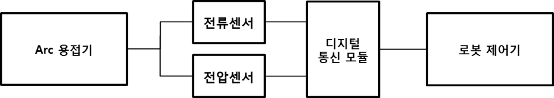
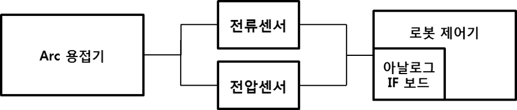
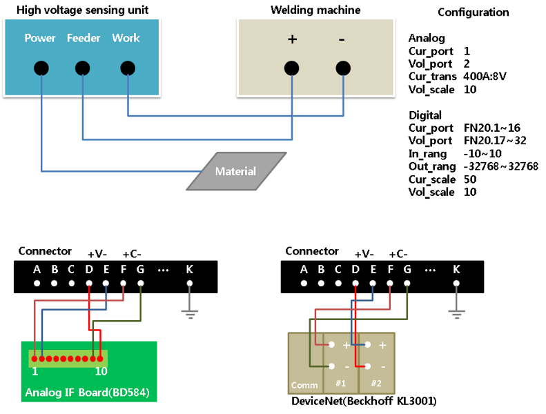

# 7.5 센서기반 Arc 용접 데이터 모니터링 기능

본 기능은 전류 센서와 전압 센서로 측정된 데이터를 제어기로 송신하여 각종 모니터링 기능을 사용 가능하게 합니다. 일반적으로 디지털 통신으로 연결된 용접기는 용접 전류와 전압을 제어기로 송신하고, 아날로그 방식으로 연결된 용접기는 용접 데이터를 송신하지 않습니다. 또한 일부 디지털 용접기는 전송하는 데이터에 왜곡이 심하여 원본 데이터와 그 차이가 크고 전송 주기가 느려 각종 기능에 활용되는데 부적합할 수 있습니다. 이렇게 제약이 많은 용접기 데이터를 센서로 실측하여 활용할 수 있는 기능이 센서기반 Arc 용접 데이터 모니터링 기능입니다.

현재 Arc 용접로봇 모니터링 기능의 목록은 아래와 같습니다.

- 실시간 모니터링 기능(세부정보, 파형, 대화면)
- Arc 용접 데이터 저장 기능
- Arc 용접 데이터 관리 기능
- Arc 용접 결과 정량화 기능
- HRMS Arc 용접 데이터 모니터링 기능

만약 용접기가 용접 데이터를 로봇 제어기로 제공하지 않으면 위 기능을 전부 사용할 수 없습니다. 또한 데이터에 왜곡이 있는 경우 부정확한 데이터를 이용하여 관리할 수도 있습니다. 그래서 센서기반 Arc 용접 데이터 모니터링 기능은 아래와 같은 상황에서 유용하게 사용됩니다.

- 용접 데이터를 로봇 제어기에 제공하지 않는 용접기
- 용접 데이터 왜곡이 심한 용접기
- 전송주기가 너무 느린 용접기


[**참고**]  
본 기능을 사용할 경우 용접기가 보내는 데이터를 사용하지 않고 센서로부터 측정된 데이터만을 사용합니다.
 

본 기능을 사용하기 위해서는 용접 중 발생하는 전류와 전압을 측정할 수 있는 센서의 연결과 측정된 용접 데이터를 제어기로 송신하기 위한 통신 장치가 필요합니다. 통신은 디지털 통신과 아날로그 통신을 모두 지원하며 현장 상황에 맞게 선택하여 사용할 수 있습니다. 통신에 따른 시스템 구성은 아래와 같습니다.

 

 </img>
 <em>
그림 7.10 센서기반 Arc 용접 데이터 모니터링 구조도(디지털 통신)
</em>

 

 </img>
 <em>
그림 7.11 센서기반 Arc 용접 데이터 모니터링 구조도(아날로그 통신)
</em>

 
 

본 기능은 『시스템』 → 『4: 응용 파라미터』 → 『2: 아크용접』 → 『[F2: 센서기반 모니터링]』으로 진입하여 설정 합니다.

 

그림 7.12 센서기반 Arc 용접 데이터 모니터링 설정화면

(1)	통신 방식: 전류/전압 센서로부터 데이터를 입력 받는 통신 방식 설정

(2)	적용 데이터: 본 기능을 적용할 데이터 (본 기능을 사용 시 용접기 데이터가 아닌 센서로 측정한 데이터를 사용)

(3)	<아날로그>
- A. 전류 입력 포트: 전류 센서의 출력이 연결된 포트
- B. 전압 입력 포트: 전압 센서의 출력이 연결된 포트
- C. 전류 환산: 센서에서 통신을 통해 보내는 값과 실제 전류 사이의 비율로 센서 사양에 표기되어 있는 경우가 많음
- D. 전압 배율: 센서에서 통신을 통해 보내는 값과 실제 전압 사이의 비율

(4)	<디지털>
- A. Word데이터 송수신 방식: 통신에 따라 Word 데이터 송수신 시 하위 바이트를 우선 보내는지 상위 바이트를 우선 보내는지 차이기 있음. 디바이스넷은 일반적으로 하위 바이트 우선 방식을 사용함
- B. 입력 범위: 통신 모듈의 사양으로 센서에서 출력되어 통신 모듈에 입력되는 값의 범위를 설정
- C. 출력 범위: 통신 모듈의 사양으로 입력되는 값을 변환하여 출력되는 값의 범위를 설정
- D. 전류포트: 전류 센서에서의 출력이 입력되는 포트
- E. 전류포트 할당: 입력되는 포트 수
- F. 전류 배율: 센서에서 통신을 통해 보내는 값과 실제 전류 사이의 비율
- G. 전압포트: 전압 센서에서의 출력이 입력되는 포트
- H. 전압포트 할당: 입력되는 포트 수
- I. 전압 배율: 센서에서 통신을 통해 보내는 값과 실제 전압 사이의 비율

당사의 고전압 터치 센싱 유닛은 전류 센서와 전압 센서를 포함하고 있어 본 기능을 통신 모듈만 추가하여 연결할 수 있습니다. 출력되는 값을 통신 모듈과 연결하고 센서기반 Arc 용접 데이터 모니터링 기능을 활성화하여 측정되는 용접 전류, 전압을 사용할 수 있습니다.

아래 그림은 고전압 터치 센싱 유닛을 사용 시 연결과 설정 예시입니다. (고전압 터치 센싱 유닛과 통신 모듈의 사양에 따라 상이할 수 있습니다.)

 </img>
 <em>
그림 7.13 고전압 터치 센싱 유닛과 센서기반 Arc 용접 데이터 모니터링 
</em>

 

