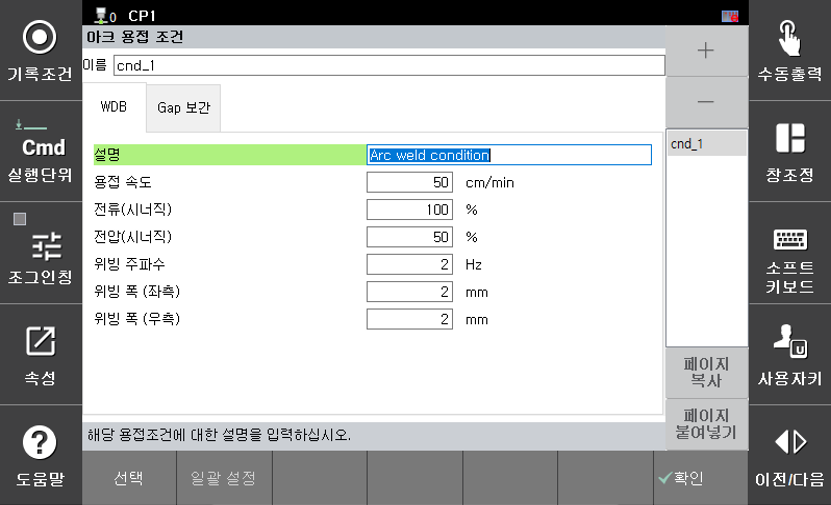

# 8.1.2 使用 WDB（焊接数据库）进行步进变化

```python
    arccond D, cnd=1
```

在上述命令中，进入属性窗口，您可以查看以下配置窗口。

 
<br>
*图 8.1.1. 弧焊条件对话框* 

<br>

您可以添加或删除 **cnd**（焊接条件），允许您将焊接条件存储并在数据库中使用，具体如下：
可以存储在数据库中的条件：焊接速度、电流、电压、编织频率、编织宽度

利用此功能，可以创建以下 JOB 配置：

```python
    move L, spd=60%, ...
    move L, spd=10%, ...	    # 焊点（缝合）进入步骤
    arcon cnd=1
    move L, spd=40cm/min, ...
    arccond D, cnd=1  	    # 立即更改为焊接数据库条件 1
    move L, spd=30cm/min, ...
    arcof
    end
```