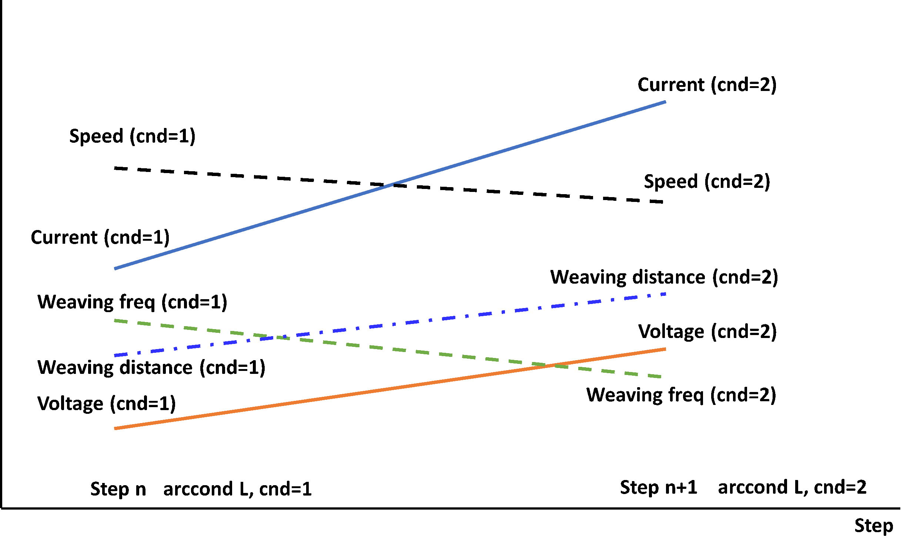

# 8.1.3 Continuous Interpolation Change using WDB(Welding DataBase)


For example, this function allows for linear interpolation of welding condition(such as current, voltage, welding speed, weaving width, and weaving frequency) while welding a workpiece where the butt gap is 5mm at the start and 25mm at the end.
In this case, the continuous change of welding conditions (L interpolation) is performed in a linear fashion as shown below.

 
<p align="center">
 </img>
 <em><p align="center">Figure 8.1.2. Linear Interpolation of Welding Conditions</p></em>
</p> 

<br>

Using the above items from DB 1 and DB 2, a JOB utilizing continuous interpolation change is as follows: 

```python
move L, spd=60%, ...
move L, spd=10%, ...	    # Weld point(seam) Entry Step
arcon cnd=1
move L, spd=40cm/min, ...
arccond L, cnd=1  	    # Continuous interpolation change from Welding DB 1 -> 2
move L, spd=30cm/min, ...    # In this step, the conditions linearly change from cnd(DB) 1 -> 2
arccond L, cnd=2  	    # The next step requires arcof
arcoff
move L, spd=10%, ...	    # Weld point(seam) Exit Step
end
```