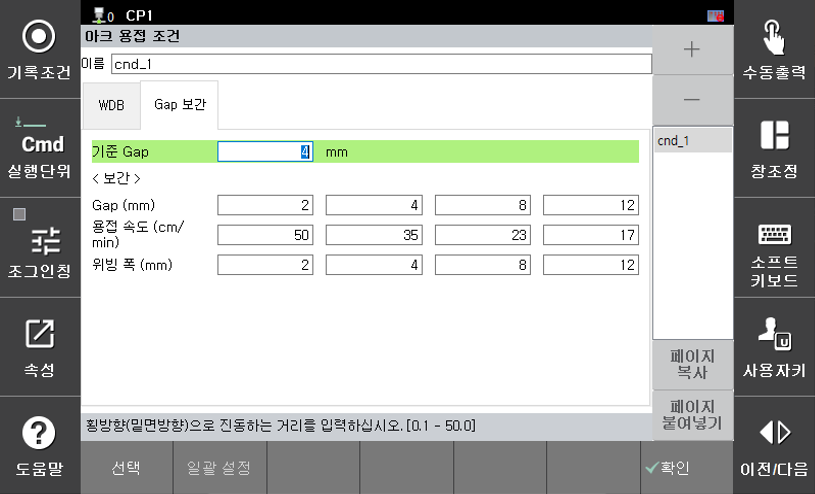
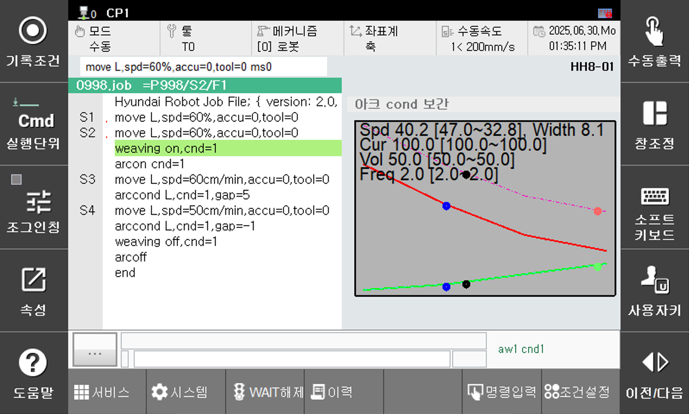
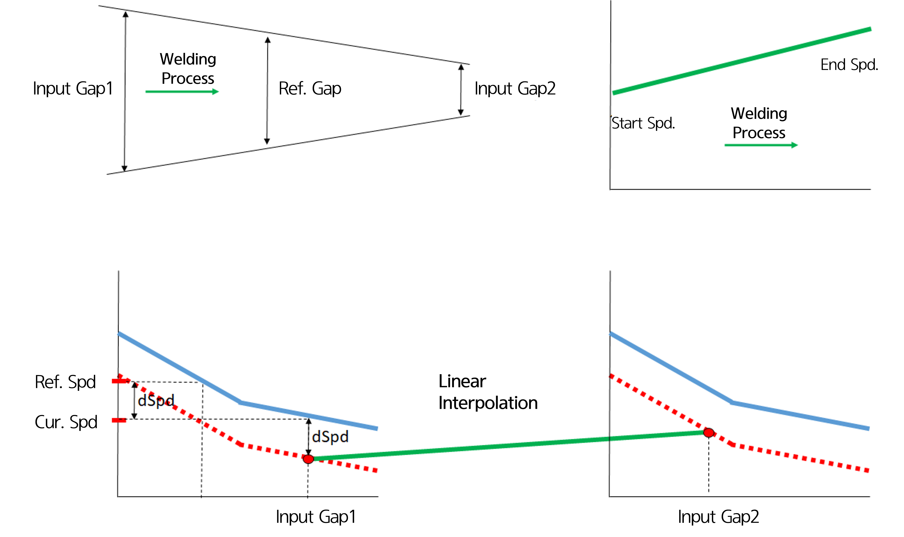

# 8.1.4 Changing the welding Speed and Weaving Width Using Interpolation Condition


This feature is separate from the previously mentioned functionalities. It allows welding conditions to be set based on the reference gap, and then automatically calculates the welding speed and weaving width by measuring the gap at the start and end points through actual touch sensing.  
By entering the "Gap correction" tab in the properties window of the `arccond` command, you can set speed and width accroding to the gap for each condition.
In the split window, clicking on "Arc interpolation" will display this setting as a graph.


<br>
*Figure 8.1.3. Arc Welding Condition(Gap correction) Dialog box* 

<br>
*Figure 8.1.4. Arc Interpolation Monitoring* 

<br>

The operation of this function is as follows:

<br>
*Figure 8.1.5. Welding Condition Interpolation Operation* 

<br>
 

The gap-speed graph can be illustrated as follows:  

The gap-spd graph entered in the Gap correction tab of the properties window of the `arccond` command is created.
At the welding start point, the difference in speed between WDB welding speed and the WDB reference speed (the spd value at the reference gap on the graph) is assumed to be bSpd. The starting speed is then calculated by applying dSpd to the Spd value of the original graph at the current gap.

Similarly, at the welding end point, the difference in speed between the WDB welding speed and the WDB reference speed (the spd value at the reference gap on the graph) is assumed to dSpd2. The ending speed is calculated by applying dSpd2 to the Spd value of the original graph at the current gap.

As shown in the figure above, the welding speed increases linearly between the two `arccond` commands.


An example of the JOB configuration is as follows:

```python
    move L, spd=60%, ...
    move L, spd=10%, ...	    # Weld point(seam) Entry Step
    arcon cnd=1
    move L, spd=40cm/min, ...
    arccond L, cnd=1, gap=20  
    move L, spd=30cm/min, ...    # In this step, welding speed and weaving width change linearly
    arccond L, cnd=2, gap=10   
    arcoff
    move L, spd=10%, ...	    # Weld point(seam) Exit Step
    end
```