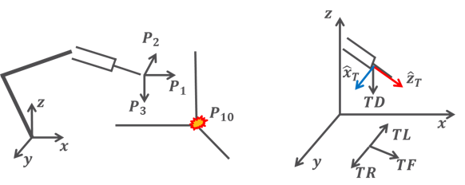
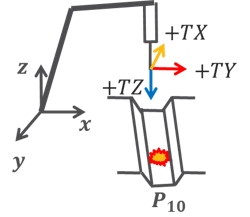
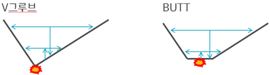

# 8.2	터치센싱 기능

터치센싱이란 작업물의 위치 및 용접시작점 혹은 용접끝점 검출을 위해 사용하는 기능입니다.

 </img>
 <em>
그림 8.41 터치센싱의 예
</em>

작업물은 지그 또는 포지셔너의 오차, 작업물의 갭들이 다르기 때문에 항상 일정한 위치에 있다고 볼 수 없습니다. 이러한 경우 터치센싱을 이용해 용접 시작점과 용접 끝점을 검출하여 용접할 수 있습니다. 또는 터치센싱을 이용하여 기준 위치를 기록해 놓으면 작업물이 들어왔을 때 기준위치에서 얼만큼 쉬프트 되어있는지 계산할 수 있습니다. 이러한 쉬프트량이 자동으로 계산되어 보정되는 기능 또한 사용 가능합니다.
 터치센싱은 그림 8.12와 같이 총 8가지 타입 (필렛, VGroove, Butt, LRCen, 응용필렛1, 응용필렛 2, DetectGroove, Wall) 을 지원합니다. 

       

 </img>
 <em>
그림 8.52 터치센싱 타입
</em>

터치센싱은 총 8개의 조건들이 존재하며 명령어에서 Quick Open을 누르면 그림 8.13과 같은 편집화면이 뜨고 편집한 내용들은 ROBOT.TSC파일에 탐색속도, 퇴피속도, 탐색거리, 진행거리, 오차보정량, 터치방식 등과 같은 조건들이 저장됩니다. 

     
그림 8.63 터치센싱 조건 편집화면

터치센싱 명령은 T.P화면에서‘명령입력’-‘아크’-‘TOUCHSEN’을 입력하여 기록할 수 있습니다. 명령어의 구성은 다음과 같습니다. 

    TOUCHSEN TSC#=조건번호, 탐색방향1, 탐색방향2, 탐색방향3, 계산된 포즈, butt gap 변수
    TOUCHSEN TSC#=조건번호, 탐색방향1, 탐색방향2, 탐색방향3, 탐색방향각도, 계산된 포즈, butt gap 변수
    TOUCHSEN TSC#=조건번호, 탐색방향1, 탐색방향2, 탐색방향3, 탐색방향각도, PAR=포즈시프트번호 butt gap 변수

    TOUCHSEN TSC#1, +TX, +TZ, 3, P10, V1!
    TSC#1		: 터치센싱 옵션번호 (ROBOT.TSC 파일의 조건에 해당하는 인덱스 번호)
    +TX, +TZ	: 탐색방향 파라미터 (직교, 포즈, 툴좌표, 툴프로젝션 입력 가능)
    3		: 바닥찍고 들어올릴 량 [mm] (Butt, V그루브), 탐지기준거리 (DetectGroove).
    P10		: 센싱하여 계산된 포즈가 저장될 포즈변수.
    V1! 		: BUTT 작업물일 경우 gap이 저장될 변수 (소수점 첫째 자리에서 반올림됨)
    QuickOpen 키 	: 탐색속도, 퇴피속도, 탐색거리, 진행거리, 오차보정량, 터치방식(닿을 때, 땔 때) 지정가능

센싱방향은 작업물 타입에 따라 다음과 같이 지정할 수 있습니다.

    Fillet	: 베이스좌표방향, 포즈방향, 툴프로젝션 방향, +TZ 방향
    Butt 	: 포즈방향, 툴방향
    V Groove 	: 포즈방향, 툴방향
    LRCen 	: 툴방향
    AP_Fille	: 툴프로젝션 방향
    DetectGroove: 툴방향, 툴프로젝션방향
    Wall 	: 직교방향, 툴방향, 툴프로젝션방향

|타입|	최대탐색  방향개수 |	직교XYZ  모든타입  지원예정	| 툴좌표계|	툴프로젝션 좌표계 |	포즈 |기타 입력인자|
|:---:|	:---: |	:---:	| :---:|	:---: |	:---: |:---:|
|Fillet|	3	|O|	O (1타점)|	O	|O|	후퇴거리|
|Butt	|2 |	X	|O	|X	|O	|오차보정량 |
|VGroove |	2 |	X |	O	|X	|O	| |
|LRCen |	1	|O |	O	|X |	X |  |	
|AP_Fillet |	2	|X |	X |	 O	| X |	진행거리 1,2 |
|AP_Fillet2	|  2 |	X	|X	|O	  |X	| 진행거리 1,2 |
|DetectGroove|	2 |	X |	O |	O |	X	| 진행거리1   후퇴거리1 |

1번 터치센싱조건 (명령어에서 Quick Open으로 사용자가 설정해놓은 조건들)에는 필렛, 2번 조건에는 버트, 3번 조건에는 V그루브로 작업물 타입이 지정되어있다고 가정할 때 예시는 아래와 같습니다. 

    TOUCHSEN TSC#=1, TF, TD, 0, P10, 0      1번 조건, 툴프로젝션 방향, 2점 터치
    TOUCHSEN TSC#=1, +X, -Y, -Z, P10, 0     1번 조건, 베이스좌표 방향, 3점 터치
    TOUCHSEN TSC#=1, P1, P2, 0, P10, 0      1번 조건, 포즈 방향, 2점 터치
    TOUCHSEN TSC#=1, +TZ, 0, 0, P10, 0      1번 조건, +TZ방향, 1점 터치
    TOUCHSEN TSC#=2, +TX, +TZ, 3, P10, V1!  2번 조건, 툴좌표계 방향, 바닥터치 후3mm 상승
    TOUCHSEN TSC#=2, P1, P2, 2, P10, V1!    2번 조건, 포즈 방향, 바닥터치 후2mm 상승
    TOUCHSEN TSC#=3, -TY, +TZ, 3, P10, 0    3번 조건, 툴좌표계 방향
    TOUCHSEN TSC#=3, P1, P2, 3, P10, 0      3번 조건, 포즈 방향

제공하는 터치센싱 방식 (작업물 타입)은 다음과 같습니다.

[1] Fillet 타입

 </img>
 <em>
그림 8.74 터치센싱 예 Fillet 타입
</em>

    TOUCHSEN TSC#=1,P1,P2,P3,P10, 0
    TOUCHSEN TSC#=1,+X,-Y,-Z,P10, 0
    TOUCHSEN TSC#=1,TF,TD,0,P10 0
    TOUCHSEN TSC#=1,+TZ,0,0,P10 0

- 툴프로젝션방식 : 툴좌표계의 Z축을 베이스 XYZ평면에 사영시켜 전진, 좌우, 하강방향을 결정하는 방식으로 TF(전진), TD(하강), TL(좌), TR(우) 를 조합하여 사용합니다. TL은 TF*RotZ(90), TR은 TF*RotZ(-90) 방향입니다.
- 용접점이 너무 많아 포즈변수 관리가 어려울 경우 툴프로젝션 방식 (TPM)을 사용합니다.
- 작업물에 회전량(RX, RY, RZ)이 존재하는 틀어진 필렛의 경우 각도지정 옵션을 이용해 탐색방향을 변경할 수 있습니다.
- 1점 센싱은 탐색방향을 한 개만 지정하고 2점 센싱은 탐색방향을 순차적으로 2개 지정합니다. 

[2] V Groove 타입

 </img>
 <em>
그림 8.85 터치센싱 예 V Groove 타입
</em>

   

V그루브 타입은 V그루브 센싱에 사용할 수 있습니다. 단, 이때 툴의 위치와 방향은 위 그림과 유사하게 각의 2등분선 상에 위치해야 합니다.

    TOUCHSEN TSC#=3, -TY, +TZ, 3, P10, 0    3번 조건, 툴좌표계 방향
    TOUCHSEN TSC#=3, P1, P2, 5, P10, 0      3번 조건, 포즈 방향

• 센싱을 위한 상승량은 최소 3mm이상이 되는 것이 안정적입니다.

 
[3] BUTT 타입

 </img>
 <em>
그림 8.96 터치센싱 예 Butt 타입
</em>

   

    TOUCHSEN TSC#=2, +TX, +TZ, 3, P10, V1!  2번 조건, 툴좌표계 방향, 바닥센싱 후3mm 상승
    TOUCHSEN TSC#=2, P1, P2, 5, P10, V1!    2번 조건, 포즈 방향, 바닥센싱 후5mm 상승

• BUTT 타입은 그림과 같이 바닥면에 수직이게 툴을 위치시키는 것이 중요합니다.  
• 센싱을 위한 바닥센싱 후 상승량은 최소 3mm이상이 되는 것이 안정적입니다.  
• 상승량에 따라서 Butt gap의 크기가 바뀔 수 있습니다. 이 경우에는 명령어의 Quick open에서 오차보정량을 입력하면 이 값을 뺀 값으로 butt gap을 계산할 수 있습니다.  

터치센싱의 진행방식은 다음과 같은 시퀀스로 진행됩니다.

필렛의 경우 4가지 옵션에 따라 직교방향, 포즈방향, 툴프로젝션방향, 툴좌표방향으로“전진->복귀” 를 반복하여 용접 시작점을 계산합니다. Butt나 V그루브의 경우 아래와 같은 형태로 센싱이 진행됩니다. (상 좌우센싱 → 바닥센싱 → 상승 → 하 좌우센싱)

 </img>
 <em>
그림 8.107 터치센싱 시퀀스 Butt 타입
</em>

   

V그루브와 Butt의 경우 하단 좌우센싱 중점에서 작업물 방향으로 내린 점이 계산된 포즈가 됩니다. DetectGroove의 경우 하단센싱→상승량만큼 상승→전진을 반복합니다. 사용자가 지정한 탐지기준보다 더 내려갈 경우 하단센싱중에 멈추게 되고 그 점이 찾은 포즈가 됩니다. 
터치센싱 명령어에서 퀵 오픈(Quick Open)을 누르면 해당 조건번호 TSC#에 대한 터치센싱 조건들을 편집할 수 있습니다. 

- 탐색거리 : 탐색방향에 대한 거리들이며 이 거리에 도달해도 작업물을 감지하지 못할 경우 에러가 발생합니다.  
- 탐색속도와 퇴피속도 : 탐색 또는 후퇴시 속도를 지정할 수 있습니다.  
- 오차보정량 : butt gap 보정시 사용됩니다.  
- 후퇴거리 : 필렛에선 처음 센싱 후 퇴피할 거리이고  DetectGroove 타입에서는 바닥을 찍고 들어올릴 거리입니다.  
- 센싱시점 : 접촉시와 접촉해제시를 지원합니다. 일반적으로 접촉시 센싱을 많이 사용하며 오차는 거의 없습니다. 만약 센싱시 와이어 휨에 의한 미세한 오차까지도 고려해 센싱해야 하는 상황에서만 후퇴시 센싱을 사용하십시오.  

각도지정옵션은 탐색방향에 대한 각도를 지정할 수 있습니다. 각도지정 옵션은 Fillet과 DetectGroove 타입에서 지원합니다. 각도지정은 TL축과 베이스 XYZ축 중 한가지 축으로 센싱각도만큼 센싱시퀀스 이동궤적을 모두 회전시킵니다. 
그림 8.18은 필렛과 DetectGroove작업물에서 Y축 또는 TL축으로 30도 회전한 예입니다.

 </img>
 <em>
그림 8.118 터치센싱 예 각도설정
</em>

       

    TOUCHSEN TSC#=1, +X, -Z, 0, Y30, P100, %V1!
    TOUCHSEN TSC#=1, +X, -Z, 0, TL30, P100, %V1!
    TOUCHSEN TSC#=2, TD, TF, 5, Y30, P100, %V1! ‘DetectGroove
    TOUCHSEN TSC#=2, TD, TF, 5, TL30, P100, %V1!‘DetectGroove

작업물 타입과 명령어에 지정된 센싱방향 지정좌표계에 따라 지정이 가능한 각도회전 축은 아래 표와 같습니다.

| 타입	| 센싱방향   지정좌표계	| 각도지정축|
|:---:|:---:|:---:|
|Fillet	| 모든 좌표계	| 직교 XYZ축  TL축 |
|Detect Groove |	툴 |	불가능 |
|Detect Groove	|툴 프로젝션	|직교 XYZ축 TL축 |

Master/Execution Mode와 연동하는 터치센싱 사용법은 다음과 같습니다. 
Master 모드에선 PAR 번호에 해당하는 포즈번호에 센싱한 포즈가 저장되며, Execution 모드에선 현재 센싱한 포즈를 Master 모드에서 센싱했던 포즈와 비교하여 쉬프트량을 계산하고 PAR번호에 해당하는 쉬프트변수에 시프트량이 기록됩니다.

    TOUCHSEN TSC#=1, +X, -Z, 0, X0, PAR=10, %V1!

PAR은 Pose And Shift의 약자로 포즈 또는 쉬프트변수의 번호를 할당합니다. 위 명령어는 Master 모드에서 P10포즈변수에 센싱한 포즈가 저장되고 Execution 모드에서 센싱했을 때 Master 모드와의 시프트 양이 자동으로 계산되어 R0번에 저장됩니다.
