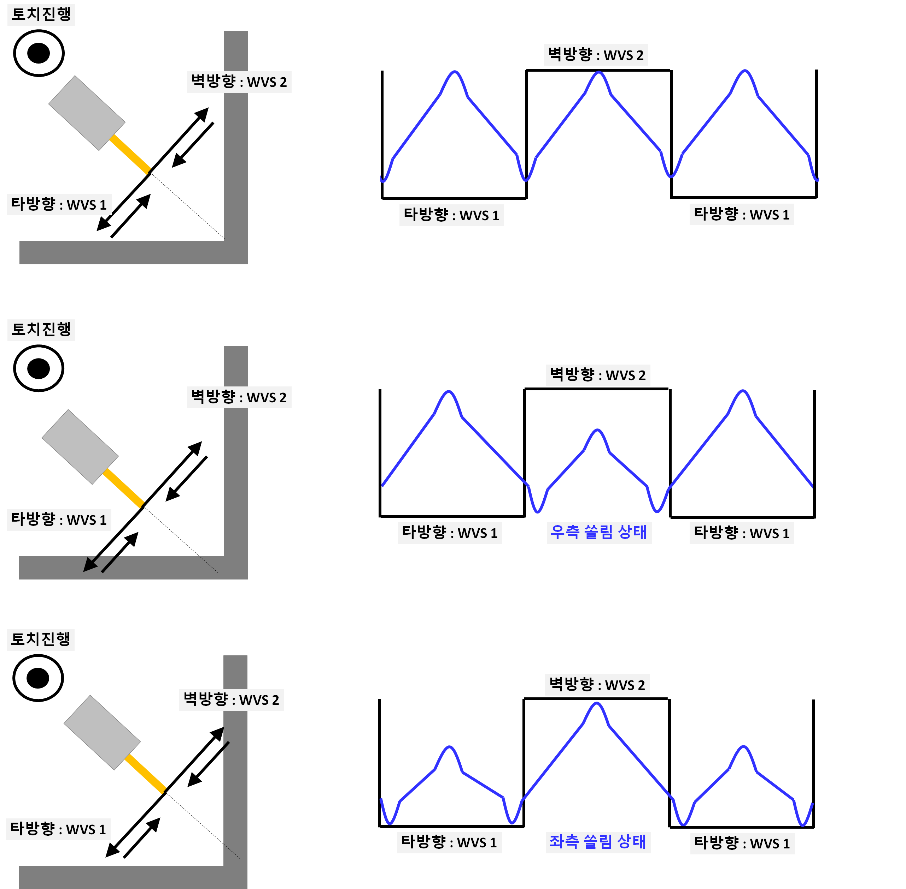

# 8.3.1 弧感应概述

在弧焊过程中，喷嘴与基材之间的距离会发生变化。
这种距离的变化会导致电阻发生变化，从而改变流动的电流。
换句话说，通过在编织段中使用电流变化，可以计算出编织平面左右方向需要修正的距离，从而能够跟踪焊缝。

焊接起始位置的高度值作为参考，而编织段中间的电流值用于在焊接过程中修正垂直方向。
或者，用户可以直接输入自定义电流值作为修正的参考，而无需使用起始位置的电流参考值。

<!-- - 左右方向修正：通过左右电流差和焊接线提取算法，机器人自动跟踪焊接线移动。
- 上下方向修正：根据焊接开始时的高度（CTWD）来维持这个值。
                  如果在焊接过程中需要高度变化，用户可以使用以下命令输入基准电流值。 -->

```py
    move L, spd=30cm/min,accu=3,tool=0  # 入口步骤
    move L, spd=30cm/min,accu=3,tool=0  # 焊接开始步骤
    weaving on, cnd=1 # 在[属性]窗口中将“弧感应”功能设置为“启用”
    arc on, cnd=1
    move L, spd=30cm/min,accu=3,tool=0
    _weaving.height_sensing_reference_current=300 # 将高度参考值设置为300A
    move L, spd=30cm/min,accu=3,tool=0
    weaving off
    arc off
    end
```  

<br>
*图8.3.1. 弧感应概念*

如图所示，当喷嘴向左或向右倾斜时，电流波形发生变化，这可以用来跟踪左右方向的焊缝。
此外，编织段中间的电流可以用来修正垂直方向。