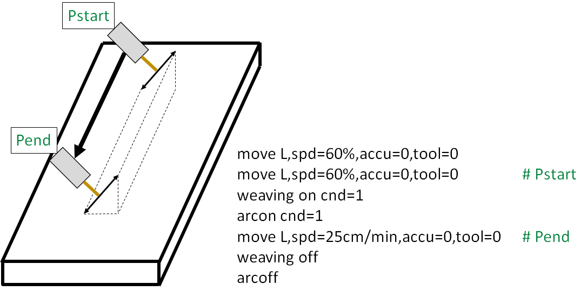

# 8.3.12 아크센싱 캘리브레이션

아크센싱 기능을 사용하기 위해 캘리브레이션이 필요합니다. 이 과정은 위빙 주기와 전류 데이터의 주기를 맞추기 위해 필요합니다. 

캘리브레이션 과정
Step 1. weaving 명령어의 속성창에서 아크센싱(일반)탭에 진입하여 타입을 "용접선 추정 & 전류차" 로 설정한 후 좌우/상하 민감도를 모두 0으로 설정하십시오.

 </img>
 <em>
그림 8.18 아크센싱 캘리브레이션
</em>

 

Step 2. 위 그림과 같이 시작점과 끝점을 50cm정도 간격을 두고 티칭하십시오.

Step 3. 자동모드로 실제 아크용접을 수행합니다.

Step 4. weaving 명령어의 속성창에서 지연시간테이블 탭에 진입하십시오. 좌측하단의 Auto calib 항목을 클릭하면 현재 켈리브레이션된 지연시간을 확인할 수 있습니다.

Step 5. 해당 값을 현재 위빙 주파수 (캘리브레이션 시 weaving의 cnd에 적용한 위빙 주파수)의 항목에 기입하십시오.

Step 6. 0.5Hz~3.0Hz 까지 Step 2 ~ Step 5 단계를 반복합니다.

0.5Hz~3.0Hz까지 위 용접을 모두 수행한 후 weaving 명령어의 속성창에서 지연시간테이블 탭의 좌측하단의 Auto calib 항목에 진입하여 Apply하면 모든항목을 일괄로 적용할 수 있습니다.

해당 캘리브레이션 과정이 끝나면 상하/좌우 센싱 민감도를 5로 모두 변경하여 아크센싱 기능을 사용할 수 있습니다.

아크센싱의 자세한 내용은 ‘아크센싱 기능설명서’ 매뉴얼을 참고하시기 바랍니다.
