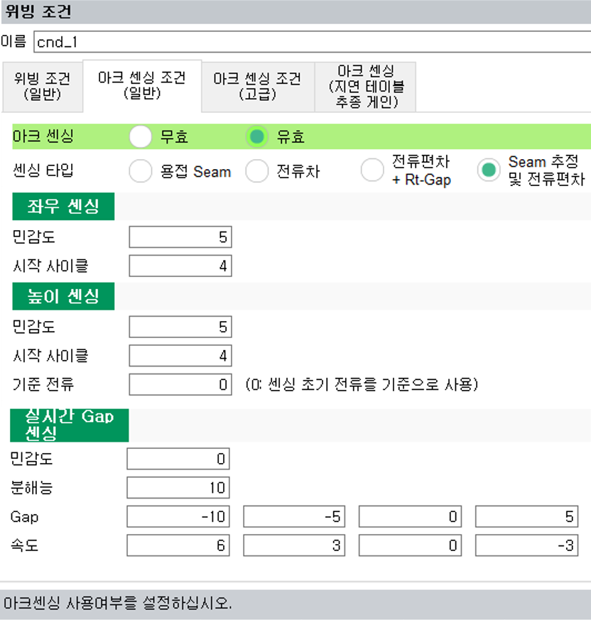

# 8.3.3.1 Arc Sensing Condition(General)


In the `Weaving` command, clickin on [Properties] opens the Weaving Condition Edit Screen.
The second tab of this window is where settings related to arc sensing during weaving can be configured, as shown below.  


<br>
*Figure 8.3.2. Arc Sensing Condition(General) Dialog Box*

The settings and operation methods for each item are as follows:  

### (1) Arc Sensing Activation: <Disable, Enable> 

This option allows you to set whether the arc sensing function is enabled or disabled.
When set to "Enabled", arc sensing tracking will be applied starting from the move command after "arc on" and "weaving" have been executed.


### (2) Sensing Type Selection: <Welding Seam, Current Difference, Current Difference + Gap, Welding Seam Estimation & Current Difference>  

<br/>

```For ${cont_model}, it is recommended to use "Welding Seam Estimation & Current Difference."```<br/>
The options for Welding Seam, Current Difference, and Current Difference + Gap are the same as for Hi5a, so please refer to the Hi5a controller manual.


### (3) Left/Right Sensing Sensitivity: [0 ~ 10]

This setting adjusts the sensitivity for left and right sensing on the weaving plane.<br>
The default value is 5, which changes the strength of the left/right sensing.<br>
```When performing delay time calibration, set this to -1.```


  During arc sensing, executing the system variable `weavings_.side_sensing_sensitivity=0` will disable tracking. To enable tracking agian, set this value to a positive number.



### (4) Left/Right Sensing Start Cycle: [0 ~ 9]

This setting determines the cycle at which left/right sensing will begin on the weaving plane.<br>
```For stable operation, set it to 4 or higher.```


### (5) Height (Up/Down) Sensing Sensitivity: [0 ~ 10]

This setting adjusts the sensitivity for up and down sensing on the weaving plane.<br>
The default value is 5, which changes the strength of the up/down sensing.<br>
```When performing delay time calibration, set this to -1.```


  During arc sensing, executing the system variable `weavings_.height_sensing_sensitivity=0` will disable tracking. To enable tracking agian, set this value to a positive number.



### (6) Height (Up/Down) Sensing Start Cycle: [Left/Right Start Cycle +1 ~ 10]

This setting determines the cycle at which up/down sensing will begin on the weaving plane.<br>
```For stable operation, set it to 4 or higher.```


### (7) Hight (Up/Down) Sensing Reference Current: [0 ~ 1000]

This setting determines the reference current for up/down sensing. <br>
The torch height during arc sensing welding wire tracking is based on this setting.<br>
```When set to 0, the average value of the initial section current will be used as the reference. (If there is a tack weld at the start of the weld, be cautious as an unintended high initial current may be used as the reference.) ```


  When `weavings_.height_sensing_reference_current=200` is executed immediately after `weaving on` and `arc on`, tracking will be maintained while keeping a height of 200A.



### (8) Real-Time Gap Sensing Sensitivity: [0(disabled) ~ 10]

<!-- This function automatically adjusts welding speed and weaving based on the gap. When not in use, set it to 0. <br>
When enabled, this setting adjusts the sensitivity of the width variation. The value should be set according to bead quality and the degree of width variation. -->

Set to 0. (Not Supported)


### (9) Real-Time Gap Sensing Resolution: [ ]  

### (10) Real-Time Sensing Gap: [ ]  

### (11) Real-Time Gap Sensing Speed: [ ]  

