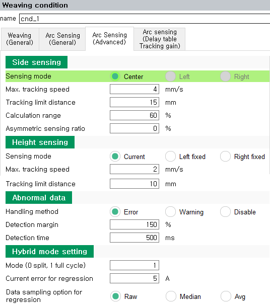
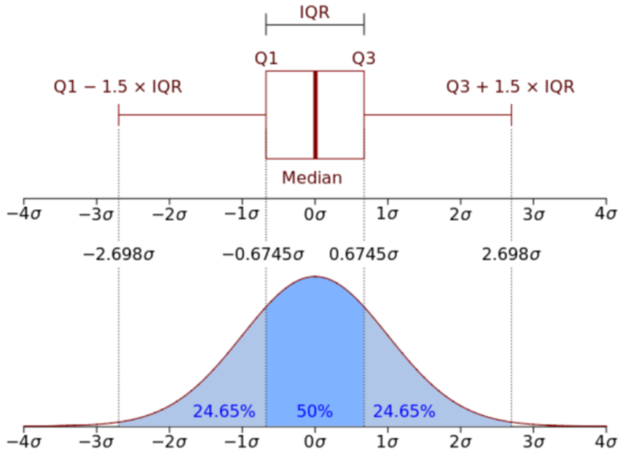

# 8.3.3.2 아크 센싱 조건(고급)


위빙 조건 편집 화면의 두 번째 탭에서 고급 기능 설정이 가능합니다. <br>

```이 탭의 내용은 가급적이면 기본(default)값을 사용하십시오.```


<p align="center">
 </img>
 <em><p align="center">그림 8.3.3. 아크 센싱 조건(고급) 대화상자</p></em>
</p>


각 항목별 설정 및 조작방법은 다음과 같습니다.

### (1) 최대 추종 속도: [0.1 ~ 20.0] mm/s

1초 동안 최대로 추종할 수 있는 좌우/상하 거리(혹은 속도)를 설정합니다.

### (2) 추종 제한 거리 : [0 ~ 200] mm (0: 무효)

좌우/상하 방향 아크 센싱 추종거리 제한치를 설정합니다. 아크 센싱에 의해서 설정된 제한 거리 이상으로 추종이 발생하는 경우 에러로 정지합니다.

### (3) 계산 범위 : [1 ~ 100] % (기본값: 60%)

좌우측 전류를 계산하기위한 범위를 설정합니다. <br>
```위빙 진폭이 작아질 수록 이 값 또한 작게 설정하는 것이 유리합니다. (ex : 1mm 진폭일 경우 50%, 0.5mm 진폭일 경우 40% 권장)```

### (4) 비대칭 센싱 비율 : [-50 ~ 50] %

비드의 좌우폭이 다를 때 이를 감안하여 센싱하기 위한 비대칭 센싱 비율을 설정합니다. <br>
+값은 토치 진행방향의 뒤에서 토치를 바라 보았을때 우측방향, - 값은 좌측방향 입니다.


아크센싱 도중 weavings_.asymetric_sensing_ratio = 10 이 실행되면 우측으로 비대칭 추종합니다. 우측 전류가 10A 높도록 추종합니다. 이 값이 음수일 경우 좌측으로 비대칭 추종합니다.

---

### (5) 비정상 데이터 처리방법: <에러, 경고, 무효>  

센싱 동작 중 ‘비정상 판별 마진’으로 계산된 정상 전류의 범위를 ‘비정상 판별 시간’이상 초과한 경우 처리하는 방법입니다.  
- 에러: 로봇은 에러를 표시하고 정지합니다.
- 경고: 로봇은 경고를 표시하고 계속 작업을 진행합니다.
- 무효: 로봇은 그대로 작업을 계속 진행합니다.

### (6) 비정상 판별 마진: [100 ~ 200] %  

전류 데이터에서 비정상으로 판단할 전류값 마진을 설정합니다. 기본값은 150% 입니다. 
아래 그림과 같이 한구간의 전류에 대해 Q1-1.5*IQR, Q3+1.5*IQR 범위를 기본으로 합니다.

<p align="center">
 </img>
 <em><p align="center">그림 8.3.4. 비정상 판별 마진</p></em>
</p>
<br>

### (7) 비정상 판별 시간: [10 ~ 1000] ms  

비정상 판별 마진을 벗어난 전류 입력을 허용할 시간을 설정합니다. 이 시간을 초과하여 마진을 벗어나는 경우 처리방법에 따라 에러, 경고, 무시 등으로 로봇이 동작합니다.

---

### (8) 하이브리드 모드 ```(용접선+전류차 타입)``` <br>

위빙 반주기마다 전류를 회귀할 것인지, 위빙 한주기마다 전류를 회귀할 것인지 설정합니다.
    
### (9) 전류 회귀 오차 허용값 ```(용접선+전류차 타입)``` <br>

회귀시 허용할 전류 오차값을 선정합니다. 위빙폭이 작거나 개선각이 작은경우 작은 값을 설정합니다. 기본값은 1A 입니다.

### (10) 회귀시 데이터 샘플링 옵션 ```(용접선+전류차 타입)``` <br>

회귀시 샘플링 데이터 처리방법 : raw 값, 메디안, 평균값 

</br>
