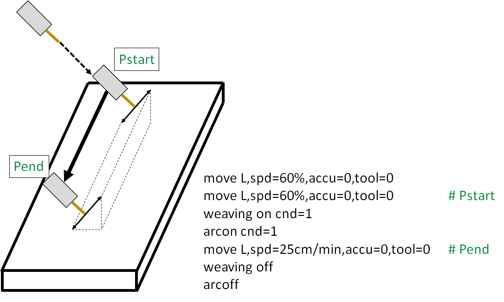
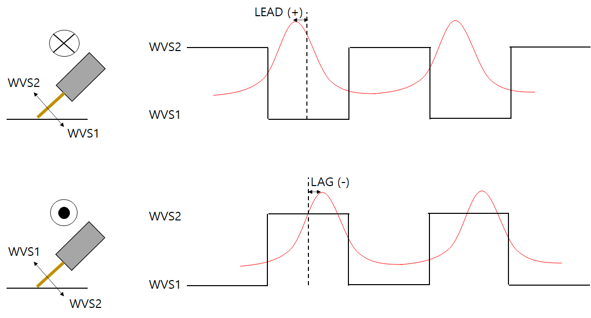

# 8.3.3.3 Arc Sensing Calibration

To use the arc sensing function, a calibration process must be completed first.  
This process calculates the delay time to synchronize the weaving cycle and the current data cycle.


  Arc sensing is dependent on welder settings, including welding mdoe, operation mode, Job/Prog number, and synergic code, and thus has a corresponding delay time. 
  Up to 3 calibration data sets can be stored. 
  Example: When the settings are Pulse, Synergic 185, Job 0 (disabled), the corresponding calibration information will be loaded and used during arc sensing.


### Calibration Process

 

#### Preparation: Prepare a flat specimen for bead-on-plate welding.

#### Step 1.  

Enter the `[Property] window of the weaving command and set the wall direction to vertical.

#### Step 2.  

Enter the Arc Sensing (General) in the property window of the weaving command, set the type to "Welding Seam Estimation & Current Difference", and set both the left/right and up/down sensitivities to -1.  

 
*Figure 8.3.5. Arc Sensing Calibration*
 

#### Step 3. 

Create an entry step to approach from the opposite direction of the virtual wall as shown in the figure above, and teach the starting and ending points with a 60 cm gap between them.  
In this case, keep the torch working angle (Roll angle) consistent within the range of 30 to 45 degrees.

#### Step 4.  

Perform the actual arc welding in automatic mode.  

#### Step 5.  

Navigate to the delay time table tab in the property window of the weaving command.  
Click on the "Auto Calib" option at the bottom left to check the currently calibrated delay time.

#### Step 6.  

Enter the corresponding value into the field for the current weaving frequency (the frequency applied during calibrations).

#### Step 7.  

Repeat Steps 2 through 5 for frequencies ranging from 0.5 Hz ~ 3.0 Hz.  

 

After completing this process, you can check the arc sensing (delay table tracking gain) results on the forth tab of the weaving condition editing screen.

 
*Figure 8.3.6. Arc Sensing Condition Tab(Tracking gain) Dialog Box*
 

At this time, the delay time value represents the degree of current lead or lag.

 
*Figure 8.3.6-2. Meaning of Arc Sensing Delay Time*
 


  The delay time must be within the range of **-40 ~ +40**. The vertical and horizontal tracking gains (mm/A) are recommended to be set within the range of **0.2 ~ 0.5**.



  Once all weaving operations from from 0.5 Hz to 3.0 Hz have been performed, navigate to the "Auto Calib" option at the bottom left of the delay time table tab in the weaving command property window, and click "Apply" to apply all settings in bulk.


Once the calibration process is completed, change the sensing sensitivity for both vertical/horizontal directions to 5 to enable the arc sensing function.

