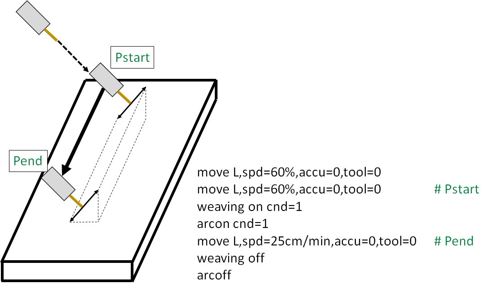

# 8.3.12 아크센싱 캘리브레이션

아크센싱 기능을 사용하기 위해 캘리브레이션 과정이 선행되어야 합니다.  
이 과정은 위빙 주기와 전류 데이터의 주기를 맞추기 위해 지연시간을 계산합니다. 


아크센싱은 용접기 설정항목인 용접모드, 동작모드, Job/Pro no, 시너직코드에 종속되어 지연시간을 갖고 있습니다. 
캘리브레이션 정보는 최대 3개까지 저장해 놓을 수 있습니다. 
예시 : 펄스, 시너직 185번, 잡 0 (무효) 일 경우 아크센싱시 해당 캘리브레이션 정보를 로딩하여 사용합니다. 


캘리브레이션 과정

준비사항 : bead on plate 용접을 위해 평평한 시편을 하나 준비하십시오.

Step 1.  
weaving 명령어의 [속성]창에 진입하여 벽방향을 vertical로 설정하십시오.

Step 2.  
weaving 명령어의 속성창의 아크센싱(일반)탭에 진입하여 타입을 "용접선 추정 & 전류차" 로 설정한 후 좌우/상하 민감도를 모두 0으로 설정하십시오.

 </img>
 <em>
그림 8.3.6. 아크센싱 캘리브레이션
</em>

 

Step 3.  
위 그림과 같이 진입스텝을 가상의 벽 반대방향에서 진입하도록 만들고 시작점과 끝점을 60cm정도 간격을 두고 티칭하십시오.  
이때 토치 작업각(Roll 각도)을 45 degree 를 유지하십시오.

Step 4.  
자동모드로 실제 아크용접을 수행합니다.

Step 5.  
weaving 명령어의 속성창에서 지연시간테이블 탭에 진입하십시오.  
좌측하단의 Auto calib 항목을 클릭하면 현재 켈리브레이션된 지연시간을 확인할 수 있습니다.

Step 6.  
해당 값을 현재 위빙 주파수 (캘리브레이션 시 weaving의 cnd에 적용한 위빙 주파수)의 항목에 기입하십시오.

Step 7.  
0.5Hz~3.0Hz 까지 Step 2 ~ Step 5 단계를 반복합니다.


0.5Hz~3.0Hz까지 위 용접을 모두 수행한 후 weaving 명령어의 속성창에서 지연시간 테이블 탭의 좌측하단의 Auto calib 항목에 진입하여 Apply하면 모든항목을 일괄로 적용할 수 있습니다.


해당 캘리브레이션 과정이 끝나면 상하/좌우 센싱 민감도를 5로 모두 변경하여 아크센싱 기능을 사용할 수 있습니다.
