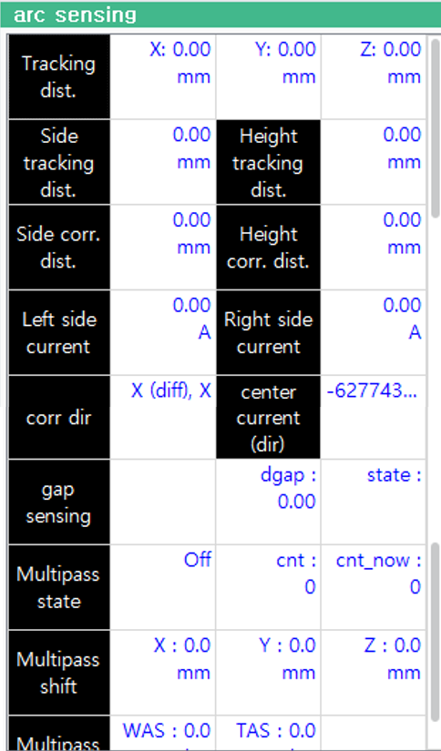

# 8.3.5 Arc Sensing Monitoring

### (1) Monitoring Execution

By accessing `[pane layout] - select - arc sensing`, the Arc Sensing Monitoring window will be activated.
This feature is only available when the Arc Sensing license is valid.

### (2)	Explanation of Monitoring Items

 
*Figure 8.3.7 Arc Sensing Monitoring*

- Left/Right Tracking: Displays the left and right distance to be corrected, calculated based on the tracking speed, distance, and current diffrential in the left-right direction by sensing.

- Up/Down Tracking: Displays the up and down distance to be corrected, calculated based on the tracking speed, distance, and welding seam in the up-down direction by sensing.

- XYZ Tracking: Displays the distance tracked so far compared to the original trajectory, in terms of the Base coordinate system's X, Y, and Z directions.

<!-- 센싱 데이터

- BC: 상하방향 센싱 기준 전류
- CC: 상하방향 센싱 용 현재 구간의 중앙 부분 전류.
- LR: 현재 구간의 위빙 끝 영역 전류
- WC: 용접기의 용접 전류
- Mode: 현재 적용 중인 지연시간, 모드 번호

상하방향 기준전류는 사용자가 입력하거나 용접 시작 영역에서 중앙 부분 전류를 일정 구간 동안 평균한 값으로 설정합니다.
상하방향의 센싱은 기준전류와 현재 측정 전류를 차이를 이용하여 보정할 상하방향 거리를 계산합니다. 따라서 기준 전류를 높이면 토치와 모재가 가까워지고 기준 전류를 낮추면 토치와 모재가 멀어집니다.

위빙 데이터: 현재 위빙폭, 위빙 주파수, 지연시간, 모드 번호를 표시합니다.

멀티패스: 저장된 멀티패스 데이터의 현재/전체 카운트, 시프트 거리, 각도를 표시합니다. -->

