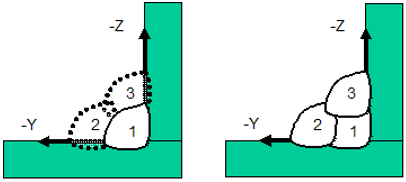
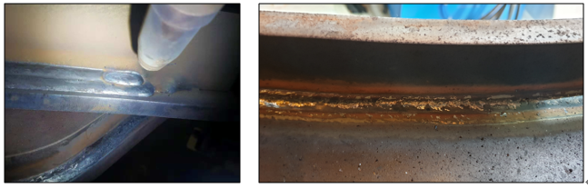
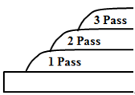

# 8.3.6 Multi-pass Overview

The multi-pass welding feature is used when the required weld length in thick plate arc welding is too wide to be completed in a single pass, or when the volume to be filled by welding is too large, requiring multiple welding passes.  

Due to the inherent characteristics of arc sensing, the sensing may be unstable except for the root pass, which is the first layer.
Therefore, only the root pass is tracked using arc sensing.
The trajectory of this pass is tehn saved, and the stored trajectory is shifted to create passes for the second layer and beyond.  

Since the position of the multi-pass work program is the same as that of the root pass trajectory, it is easy to perform multi-pass welding by simply copying the root pass work program and inserting the multi-pass command.

 
*Figure 8.3.8 Root Pass Arc sensing (left) and Multi-pass welding for 2-3 layers*

 
*Figure 8.3.9 Actual Multi-Pass Welding*

When creating multi-pass beads in a stacked, inclined configuration as shown in Figure 2 above, welding can be performed by modifying only the start and end points of the weld and slightly shifting them.  
This will result in a stacked configuration as shown below.

 
*Figure 8.3.10 Multi-pass Stacked Shape with Inclination*