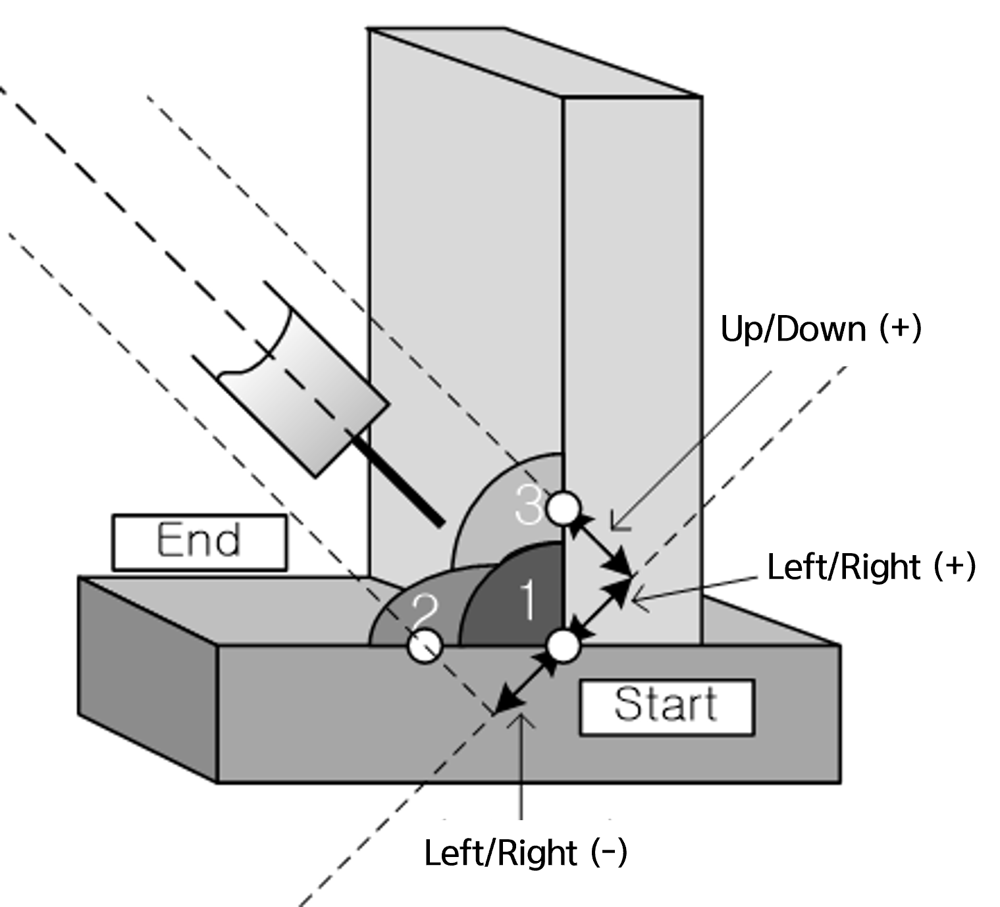
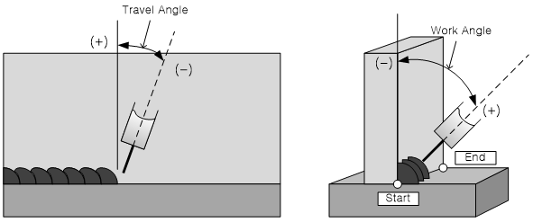

# 8.3.7 멀티패스 명령어


### (1) 명령어

센싱 궤적은 multipass 명령어를 사용하여 저장하고 로딩할 수 있습니다. 이 명령어는 3가지 형태로 사용할 수 있습니다.<br>

```py
    multipass save, trj=<멀티패스 궤적 번호>, period=<궤적 저장 주기 거리>
    multipass load, trj=<멀티패스 궤적 번호>, side=<좌우 시프트 거리>, height=<상하 시프트 거리>, reverse=<멀티패스 재생방향>, tas=<토치 전후방향 각도 시프트>, was=<토치 좌우방향 각도 시프트>
    multipass off
```

### (2) 멀티패스 파라미터

멀티패스 명령어 파라미터는 다음 링크를 참고하십시오.  <br>
[2.11 multipass](../../2_Command/11_multipass.md)

이 장에서는 다음 두 가지에 대해서만 설명합니다.

- 좌우/상하 시프트  

멀티패스 재현 시 원래 궤적에서 시프트 하는 거리를 설정합니다. 토치의 위빙이 툴과 직각이므로 각 시프트는 아래와 같이 설정됩니다. 즉, 좌우 방향은 위빙면이 되고 상하 방향은 위빙면과 수직인 면이 됩니다.

<br>
*그림 8.3.11 멀티패스 시프트 방향*

- 각도 시프트: TAS, WAS  

멀티패스 용접을 수행할 때 품질을 위해 토치를 기울여야 하는 경우 설정합니다.
각 항목의 각도 개념은 하기 그림과 같습니다.

<br>
*그림 8.3.12 멀티패스 각도 시프트 개념*
