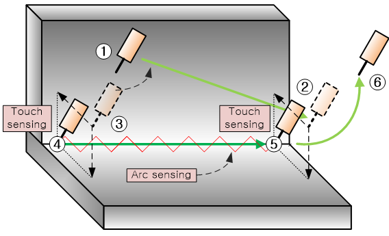

# 8.3.8 采用触摸传感和弧传感的焊缝焊接示例

一般来说，弧传感功能与触摸传感功能一起使用。触摸传感用于准确检测焊接的起止位置，而弧传感用于在焊接开始后移动时确定正确的焊接方向。

第一个示例演示了一个基本的焊缝焊接操作。

工作顺序如下：

1) 设置摆动条件、弧传感条件和焊接条件。  
2) 使用触摸传感搜索焊接起始位置。  
3) 移动到接近焊接结束区域的位置，然后使用触摸传感搜索焊接结束位置。  
4) 从焊接起始位置执行焊接操作，使用摆动命令和弧焊命令。  

 
*图 8.3.13 焊缝触摸传感和弧传感*

示例程序如下所示。

~~~~~~~弧传感程序 : 0001.JOB~~~~~~~~~~~~~~~ 
' 弧传感程序  
S1   move P,spd=60%,accu=3,tool=1              ' 1: 动作起始点  
S2   move L,spd=30%,accu=3,tool=1              ' 2: 焊接结束点的触摸传感位置  
     var p10=cpo()  
     var p1=cpo()  
     touchsen cnd=1,crd="robot", dir=["x","-z"], pose=p10   ' 3: 焊接结束点的触摸传感。位置存储在 P10  
S3   move L,spd=30%,accu=3,tool=1              ' 4: 焊接起始点的触摸传感位置  
     touchsen cnd=1,crd="robot",dir=["-x","-z"], pose=p1    ' 5: 焊接起始点的触摸传感。位置存储在 P1  
S4   move L,p1,spd=20%,accu=3,tool=1            ' 6: 移动到焊接起始点  
     weaving on, cnd=1                          ' 7: 开始摆动和弧传感  
     arcon cnd=1                                ' 8: 开始焊接  
S5   move L,p10,spd=60cm/min,accu=3,tool=1      ' 9: 移动到焊接结束点  
     arcoff                                     '10: 结束焊接  
     weaving off                                '11: 结束摆动和弧传感  
S6   move P,spd=60%,accu=3,tool=1               '12: 动作结束点  
     END  
~~~~~~~~~~~~~~~~~~~~~~~~~~~~~~~~~~~~~~~~~~~~~~~~~~