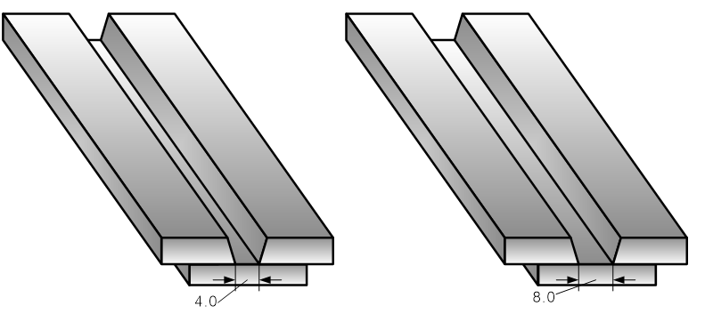
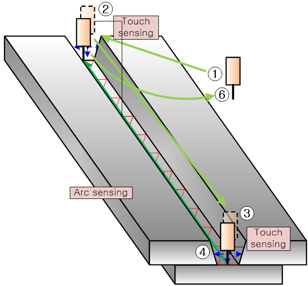

# 8.3.9 弧传感示例：使用触觉传感设置自动织造宽度

创建一个适用于下面显示的两个工件的单个作业程序。

 
*图 8.3.14 触觉传感和弧传感的对接接头工件*

假定操作条件  

- 焊接两个工件之间的接头的过程，180° 平面织造，
- 焊接行程方向：X+。在 Y 方向上进行左右触觉传感。
- 弧传感参数设置假定已提前完成。
- 当间隙为 4.0 mm 时，焊接速度为 7.0mm/sec
- 当间隙为 8.0 mm 时，焊接速度为 3.5mm/sec

工作顺序如下：

1) 使用触觉传感命令，在对接接头的 **终点** 处测量焊接中心位置和间隙距离。
2) 使用触觉传感命令，在对接接头的 **起点** 处测量焊接中心位置和间隙距离。
3) 检查 gap_var 值是否在允许范围内。如果间隙在 2.0 mm 到 10.0 mm 之外，停止机器人。
4) 将测得的间隙距离的一半设置为每侧的织造偏移：左侧（墙侧）和右侧（对侧）。
5) 根据 4.0 mm 和 8.0 mm 间隙处的速度通过插值计算焊接速度。如果间隙小于 4.0 mm，应用固定速度 7.0 mm/s。如果间隙超过 8.0 mm，应用固定速度 4.0 mm/s。
6) 自动应用计算出的织造宽度和焊接行程速度，然后进行焊接操作。
7) 操作完成后，返回原始起始位置。

 
*图 8.3.15 对接接头触觉传感和弧传感*

示例程序如下所示。

~~~~~~~弧传感程序: 0002.JOB~~~~~~~~~~~~~~~ 
     ' 对接接头弧传感程序 
     ' 条件 No. 1: 起始条件，条件 No. 10: 结束条件
S1   move P,spd=60%,accu=3,tool=1              ' 1: 动作起点  
S2   move L,spd=30%,accu=3,tool=1              ' 2: 焊接终点的触觉传感位置  
     var p10=cpo()  
     var p1=cpo()  
     var gap_var1=0  
     var gap_var11=0  
     touchsen cnd=2,crd="tool",dir="+ty",lift_up=5,pose=p10,gap=gap_var11  
                                                ' 3: 焊接终点的触觉传感。位置存储在 P10  
S3   move L,spd=30%,accu=3,tool=1              ' 4: 焊接起点的触觉传感位置  
     touchsen cnd=3,crd="+ty",lift_up=5,pose=p1,gap=gap_var1  
                                                ' 5: 焊接起点的触觉传感。位置存储在 P1  

     ' 根据起点的间隙计算焊接速度和织造宽度  
     var V3=0  
     IF gap_var1<2.0 OR gap_var1>10.0 THEN      ' 间隙超出允许范围  
     GOTO *Error  
     ELSEIF gap_var1<4.0 THEN                   ' 如果间隙 ≤ 4 mm，则固定速度为 7 mm/s  
     V3=7.0                                     ' 起始焊接速度  
     ELSEIF gap_var1>8.0 THEN                   ' 如果间隙 ≥ 8 mm，则固定速度为 4 mm/s  
     V3=4.0                                     ' 起始焊接速度  
     ELSE                                       ' 对于间隙范围 4-8 mm 的线性插值  
     V3=(7-3.5)/(4-8)*gap_var1+10.5             ' 起始焊接速度的线性插值  
     ENDIF  

     var V4=gap_var1/2.0                        ' 左侧织造宽度（间隙的一半）  
     var V5=gap_var1/2.0                        ' 右侧织造宽度（间隙的一半）  

     '--------------------------------------------------------  
     ' 根据终点的间隙计算焊接速度和织造宽度  
     var V13=0  
     IF gap_var11<2.0 OR gap_var11>10.0 THEN    ' 间隙超出允许范围  
     GOTO *Error  
     ELSEIF gap_var11<4.0 THEN                  ' 如果间隙 ≤ 4 mm，则固定速度为 7 mm/s  
     V13=7.0                                    ' 结束时的焊接速度  
     ELSEIF gap_var11>8.0 THEN                  ' 如果间隙 ≥ 8 mm，则固定速度为 4 mm/s  
     V13=4.0                                    ' 结束时的焊接速度  
     ELSE                                       ' 对于间隙范围 4-8 mm 的线性插值  
     V13=(7-3.5)/(4-8)*gap_var11+10.5           ' 结束时的焊接速度的线性插值  
     ENDIF  

     var V14=gap_var11/2.0                      ' 左侧织造宽度  
     var V15=gap_var11/2.0                      ' 右侧织造宽度  

     '---------------------------------------------------------  
S4   move L,1,S=20%,A=3,T=1                     ' 6: 移动到焊接起点  
     weaving on, cnd=2                          ' 7: 开始织造和弧传感  
     arcon cnd=2                                ' 8: 开始焊接  
     arc_cond L,spd=V3,ld=V4,rd=V5,freq=2       ' 9: 焊接参数的连续变化（开始）  

S5   move L,p10,spd=60cm/min,accu=3,tool=1      '10: 移动到焊接终点  
     arc_cond L,spd=V13,ld=V14,rd=V15,freq=2    '11: 焊接参数的连续变化（结束）  
     arcoff                                     '12: 结束焊接  
     weaving off                                '13: 结束织造和弧传感  

S6   move P,spd=60%,accu=3,tool=1               '14: 动作终点  
     END  

     *Error                                     '15: 间隙超出范围时的逃生例程  
     DO200=1                                   '16: 输出信号指示错误  
     STOP                                      '17: 停止机器人  
     END  
~~~~~~~~~~~~~~~~~~~~~~~~~~~~~~~~~~~~~~~~~~~~~~~~~~