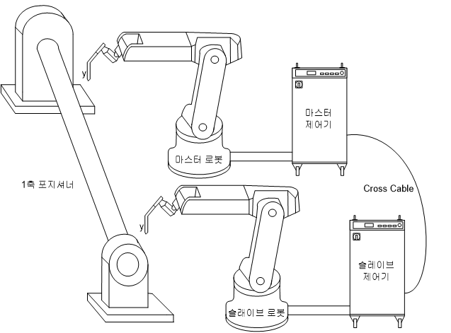

# 8.4.2 조작

아래 그림과 같이 한 대의 포지셔너에 두 대의 로봇이 동시에 Arc 용접을 실행할 때 협조제어 Arc 기능을 사용합니다. 이 경우 로봇 두 대의 용접작업이 동시에 이루어지지 않으면 작업에 불량이 발생하게 됩니다.

 

 </img>
 <em>
그림 8.14 협조제어 Arc용접기능 개념도
</em>

협조제어로 설정되어 있는 경우 “ARCON ASF#=??” 명령어에서 [QucikOpen]키를 눌러서 『용접 시작조건』설정화면으로 진입 후 다음화면으로 이동하면 아래 그림의 메뉴들이 추가로 나타납니다. GB2/GZ4/GE2 용접기를 사용하는 경우 협조제어 설정은 『용접시작조건』 설정화면의 세 번째 페이지에 위치하게 됩니다.

 

그림 8.15 협조제어 설정 시 ARC용접 시작조건 대화상자

각 항목별 설정 및 조작방법은 다음과 같습니다.

    (1) 마스터 로봇번호가 1번, 슬레이브 로봇번호가 2번이라고 예를 들면 마스터 쪽 제어기의 설정은 다음과 같이 할 수 있습니다.
       - 상태출력포트: GE4 (1~4번 중 선택가능)
       - 상태입력포트: GE8 (슬레이브 쪽 상태출력포트와 일치시킴)

    (2) 슬레이브 쪽 제어기의 설정은 다음과 같이 할 수 있습니다.
       - 상태출력포트: GE8 (5~8번 중 선택가능)
       - 상태입력포트: GE4 (마스터 쪽 상태출력포트와 일치시킴)

    (3) 협조제어를 통하여 두 로봇이 동시에 ARCON이 실행되도록 합니다. 자세한 방법은 ‘협조제어 기능설명서’를 참조하십시오.

    (4) 두 로봇이 동시에 Arc 점화에 성공하면 두 로봇이 함께 Arc용접이 실행되면서 이동을 실행하게 됩니다.

    (5) 한 로봇의 Arc 점화가 실패하게 되면 다른 한 로봇도 Arc 중단 후 동시에 재시도 기능을 실행합니다. 이후 점화가 동시에 성공하면 정상적인 이동이 실행됩니다.

    (6) 용접 수행 중 정지, 에러 등으로 인해 로봇 한 대의 Arc용접이 중단될 경우 다른 한 대의 로봇도 Arc용접을 중단합니다. 에러요인 제거 후 재기동을 하면 두 로봇이 함께 오버랩 기능을 실행한 후 다시 본 용접작업으로 진입하게 됩니다.

    (7) 용접 중간에 로봇 한 대의 용접이 ARCOF명령어를 통하여 정상적으로 종료되는 경우 다른 로봇의 Arc용접작업에는 영향을 주지 않습니다.
