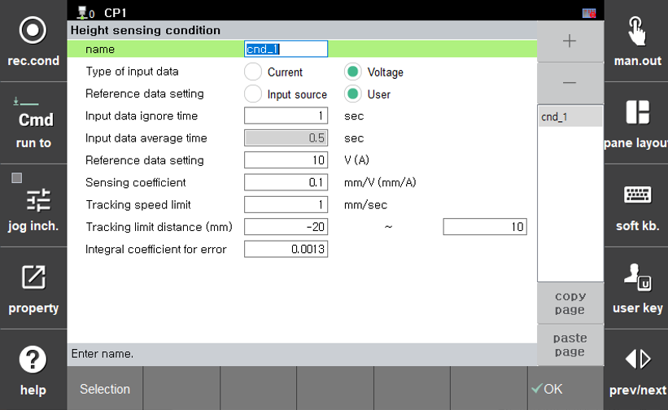

# 8.4.1 高度传感条件

按下 **[Property]** 键在 `heightsen` 命令中访问“高度传感条件”设置屏幕。条件设置屏幕如下所示。

 
*图 8.4.2. 高度传感条件对话框*

---

每个项目的设置和操作如下：

### (1) 条件编号: [1 ~ 8]

设置高度传感条件编号。

### (2) 输入数据类型

显示输入数据的类型。对于GMAW，使用焊接电流，而对于TIG焊接，使用焊接电压。

### (3) 基准数据设置: <平均输入数据, 用户输入数据>

选择设置基准数据的方法。
- 平均输入数据 : 根据传感初始基准数据的平均值设置基准数据。
- 用户输入数据 : 允许用户直接输入基准数据。

### (4) 输入数据忽略时间: [0.0 ~ 5.0]

在不稳定的初始焊接状态期间忽略信号的时间。
如果使用“平均输入数据”设置基准数据，则此时间用于在指定时间内计算基准值的平均值。
如果使用“用户输入数据”，高度传感立即开始。

### (5) 输入数据平均时间: [0.5 ~ 10.0]

设置用于计算传感基准数据的输入数据平均时间。
当选择“平均输入数据”作为基准数据设置方法时，此项目出现。
(如果准确的参考高度尚未确定)

### (6) 基准数据设置: [-500.0 ~ 500.0]

这是用户直接输入高度传感基准值的项目。当选择“用户输入数据”作为设置基准数据时，此项目出现。

### (7) 传感系数: [-100.0 ~ 100.0]

这是与输入数据差异对应的距离系数。较小的值会导致更平滑的跟踪，对输入数据的响应性较低，而较大的值则增加跟踪速度，但可能导致轨迹中的振荡。

### (8) 跟踪速度限制: [0.1 ~ 10.0]

这是根据传感设置的每秒最大跟踪值。较小的值会导致更平滑的跟踪，而较大的值则加快跟踪速度。

### (9) 跟踪限制距离: [-300.0 ~ 0.0] ~ [0.0 ~ 200.0]

设置高度传感的总跟踪距离限制。

### (10) 误差的积分系数: [0.00 ~ 10.00]

设置高度传感性能中持续误差值的校正量。
设置大于0的值可以提高跟踪性能，但如果值过大，可能会导致轨迹中的振荡。
从非常小的值开始，并逐渐调整到适合现场的设置。