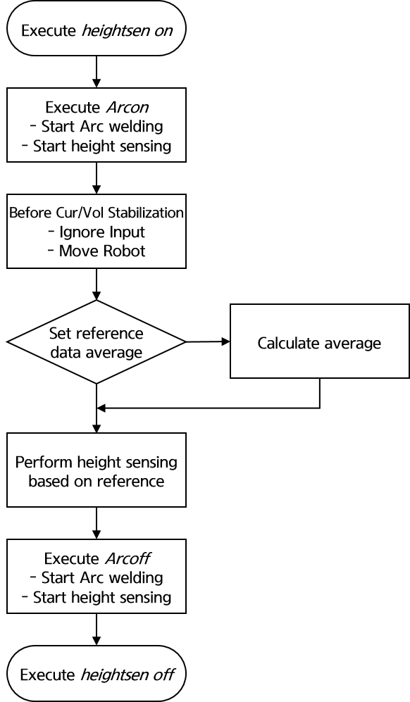

# 8.4 高度感应

此功能用于机器人工具需要与工件保持恒定距离的情况，例如 TIG 焊接。在 TIG 焊接中，高度与弧长成正比，这就是为什么此功能被称为弧电压控制（Arc Voltage Control，AVC）。与工件的距离由传感器输入的模拟电压、焊接机检测到的弧长修正参数，以及焊接电流或电压值进行调整。

<!-- 本功能的使用需要将感应功能的数据输入设置为“有效”。 
有关感应功能的数据输入设置的详细信息，请参考“1.3 弧焊应用条件设置”。 -- ???? -->

一旦感应功能输入数据的设置完成，可以通过以下过程使用高度感应功能。

### (1) 命令

要启动高度感应，使用命令 `height on, cnd=1`。
命令后面跟着条件编号。共有 8 种高度感应条件。
要停止高度感应，使用命令 `height off`。
停止命令不需要任何额外的参数。

带有高度感应命令的作业程序示例如下：

```python
    S1   move L,spd=100%,accu=1,tool=0
    S2   move L,spd=20%,accu=1,tool=0
    S3   move L,spd=100mm/s,accu=1,tool=0
         heightsen on, cnd=1		  # 启动高度感应
         arcon cnd=2		       # 启动弧焊接
    S4   move L,spd=10mm/s,accu=1,tool=0
         arcoff			       # 结束弧焊接
         heigghtsen off			  # 结束高度感应
    S5   move L,spd=20%,accu=1,tool=0
         END 
```

### (2) 高度感应功能操作顺序

高度感应在执行 ```arcon``` 命令后开始。由于电流和电压在焊接开始时通常不稳定，因此在其稳定之前，输入数据将被忽略。
一旦输入数据稳定，就根据设置参考数据的方法计算平均值。如果用户手动输入参考数据，则立即进行高度感应。

高度感应的操作顺序如下：

<p align="center">
  </img>
  <em><p align="center">图 8.4.1. 高度感应功能操作顺序</p></em>
</p>