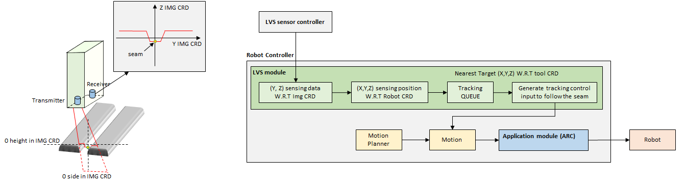
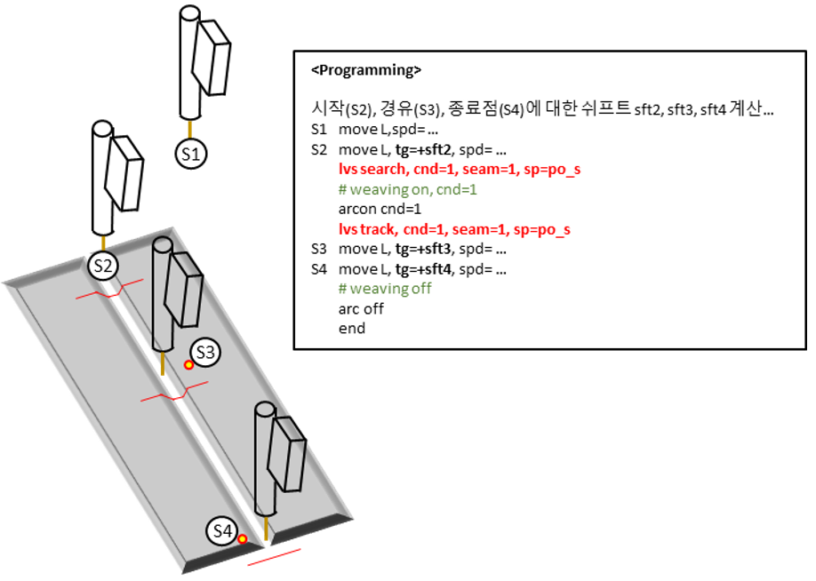

# 8.5.1 LVS 개요


해당 기능은 60.30-03 이후 버전에서 지원합니다.



로봇의 플랜지에 LVS 마운트를 직결하십시오. 즉, 플랜지-LVS 마운트-쇼크센서(사용시)-토치 의 기구부를 갖도록 설치하십시오.


본 기능은 LVS로 용접선을 인식하여 환경에 따라 변경된 용접선을 검출하고 추적하여 안정적인 용접 품질을 제공합니다. 

LVS는 로봇의 토치 전단 마운트에 설치되어 용접선을 인식하고, 로봇은 해당 정보를 이용하여 로봇의 툴을 용접선으로 이동시킵니다. 

LVS를 이용하면 용접 대상물의 위치가 변하여 기존 교시점에서 벗어나는 경우에 용접선으로 로봇의 툴 끝을 이동시켜 정확하게 용접을 할 수 있습니다.

즉, 용접 대상물의 위치 변화가 빈번하거나 용접선이 균일하지 않을 경우에도 안정적인 용접 품질을 얻을 수 있습니다.

<p align="center">
 </img>
 <em><p align="center">그림 8.18 LVS 용접선 추적 데이터 흐름도</p></em>
</p>

</br>

LVS 용접선 추적 및 검출 기능은 ```lvs``` 명령어를 통해 수행하며 T.P의 [명령입력]-[아크]-[lvs] 를 입력하여 명령어를 입력할 수 있습니다.<br>
명령어의 구성은 다음과 같습니다.

```python
lvs 기능인자 cnd=조건번호, seam=센싱하고자 하는 프로파일 번호, sp=센싱된 위치의 포즈변수, mp=마스터 기준 포즈변수, ms=마스터 대비 현재 센싱위치 쉬프트변수
```

기능인자 : laser_on, laser_off, seam_find, seam_find_p, auto_calib, search, step_search, track 등을 입력하여 수행하고자 하는 기능을 지정합니다.

<table>
  <thead>
    <tr>
      <th style="text-align:left">항목</th>
      <th style="text-align:left">설명</th>
    </tr>
  </thead>
  <tbody>
    <tr>
      <td style="text-align:left">laser_on</td>
      <td style="text-align:left">레이저를 켭니다.</td>
    </tr>
    <tr>
      <td style="text-align:left">laser_off</td>
      <td style="text-align:left">레이저를 끕니다.</td>
    </tr>
    <tr>
      <td style="text-align:left">seam_find</td>
      <td style="text-align:left">현재 센서가 센싱하고 있는 레이저의 seam 위치를 명령어의 sp인자에 지정된 포즈변수(로봇/베이스좌표계)에 저장합니다.<br>
      단, 자세(RX, RY, RZ)는 명령어 수행시 툴의 자세로 기록됩니다.</td>
    </tr>
    <tr>
      <td style="text-align:left">seam_find_p</td>
      <td style="text-align:left">현재 센서가 센싱하고 있는 레이저의 seam 위치를 명령어의 sp인자에 지정된 포즈변수(로봇/베이스좌표계)에 저장합니다.<br>
      단, 자세(RX, RY, RZ)는 기존 포즈변수 값이 유지되며 X, Y, Z 값만 저장합니다.<br>
      intersection 등의 함수로 3점을 이용해 교점을 포즈로 찾는 경우 유용하게 사용할 수 있습니다.</td>
    </tr>
    <tr>
      <td style="text-align:left">auto_calib</td>
      <td style="text-align:left">TCP-LVS 간 오토캘리브레이션을 수행합니다. (8.5.3절 참고)</td>
    </tr>
    <tr>
      <td style="text-align:left">search</td>
      <td style="text-align:left">+ToolX, -ToolX 방향으로 이동하면서 시작점을 찾고 트래킹 준비를 수행합니다.<br>
      찾은 시작점은 명령어의 sp인자에 지정된 포즈변수에 저장됩니다.(8.5.6절 참고)</td>
    </tr>
    <tr>
      <td style="text-align:left">step_search</td>
      <td style="text-align:left">+ToolX, -ToolX 방향으로 이동하면서 시작점 또는 다단비드의 시작점 등을 찾습니다.<br>
      찾은 시작점은 명령어의 sp인자에 지정된 포즈변수에 저장됩니다.(8.5.6절 참고)</td>
    </tr>
    <tr>
      <td style="text-align:left">track</td>
      <td style="text-align:left">search가 완료된 후 arcon 및 weaving on 이 수행된 뒤 실행되어야 합니다.
      arcoff를 만날때 까지 트래킹을 수행합니다.</td>
    </tr>
  </tbody>
</table>

조건번호 : lvs 명령어의 속성 창에 설정된 내용을 사용하기 위한 조건번호입니다. 속성창에서 탐색속도, 탐색길이, 큐간격, 추종제한치, 센싱좌표계(로봇/베이스) 등을 설정할 수 있습니다.

센싱하고자 하는 프로파일 번호 : LVS 제어기에 사용자가 등록한 센싱형상 및 센싱조건에 해당하는 번호입니다. 명령어 수행시 LVS제어기는 이 번호에 대한 센싱형상 및 조건을 load 합니다. 

센싱된 위치의 포즈변수 : 현재 레이저의 위치에 해당하는 위치를 포즈변수로 저장합니다.

마스터 기준 포즈변수 : 마스터 모드에서 등록된 기준 포즈변수입니다. (8.5.5절 참고)

마스터 대비 현재 센싱위치 쉬프트변수 : mp 대비 현재 센싱한 위치의 쉬프트가 저장됩니다. (8.5.5절 참고)


lvs 명령어를 이용한 트래킹기능은 다음과 같이 사용할 수 있습니다.

<p align="center">
 </img>
 <em><p align="center">그림 8.19 LVS 용접선 추적을 위한 명령어 실행</p></em>
</p>