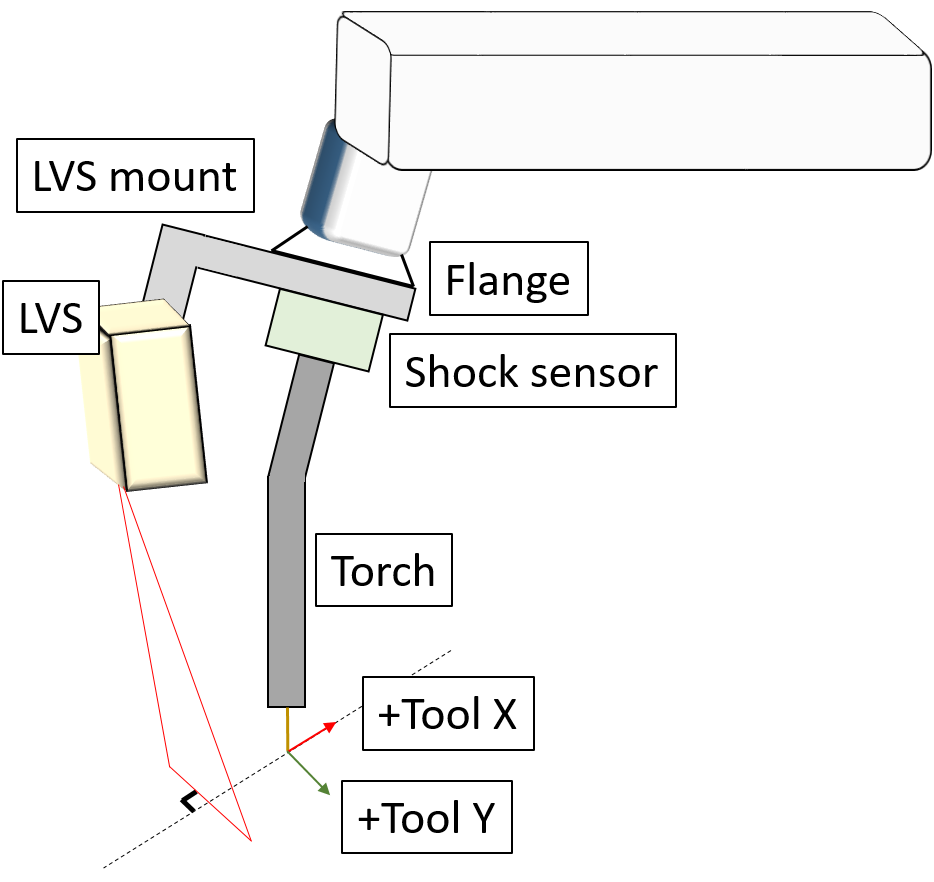
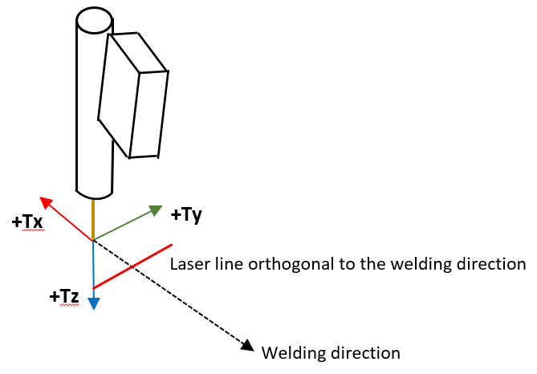
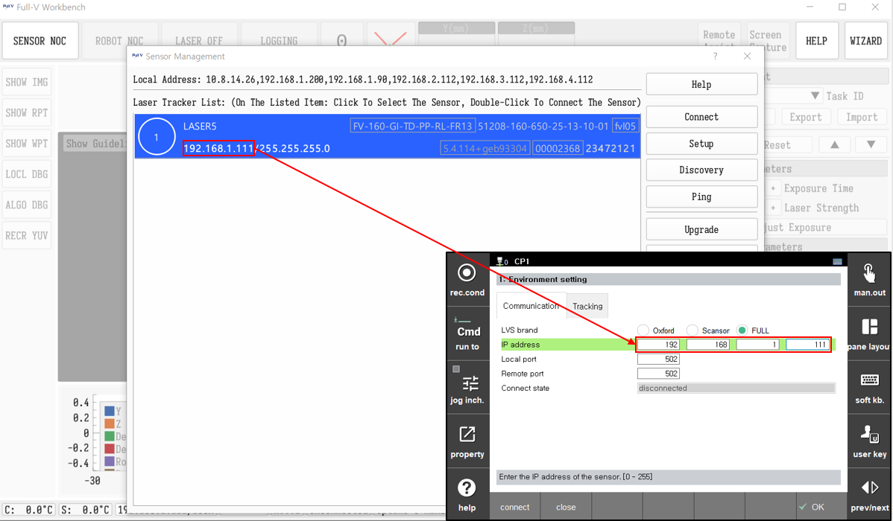
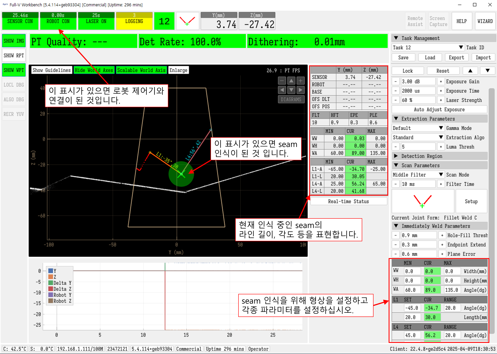

# 8.5.2 LVS(Laser Vision Sensor) 기본설정

LVS기능을 사용하기 위해서는 센서 설치 및 통신 설정이 필요합니다.

지금부터 해당 과정을 살펴보겠습니다.

### (1) 연결 브라켓을 이용한 LVS센서의 장착

연결 브라켓은 직접 설계하여 사용하거나 HD현대로보틱스 또는 LVS 제조사로부터 받아 사용하십시오. 

 
*그림 8.5.3. LVS 장착시 주의점*


반복 정확도 (Accuracy) 및 정밀도(Precision) 달성을 위해 로봇의 플랜지에 LVS 마운트를 직결하십시오. 
즉, 플랜지 - LVS 마운트 및 LVS센서 - 쇼크센서(사용시) - 토치 의 기구부를 갖도록 설치하십시오.


툴 좌표계는 아래 그림과 같이 용접 진행 반대 방향을 +Tool X 방향, 와이어 방향을 +Tool Z 방향으로 설정해야합니다. 

LVS 센서는 직선인 용접선을 기준으로 수직으로 레이저가 위치하도록 설치해야 합니다. (그림 참조)

 
*그림 8.5.4. TCP와 센서설치, 툴좌표계의 설정*


툴 좌표계를 설정하는 방법은 툴 캘리브레이션 및 각도보정 메뉴얼 항목을 참고하십시오.



LVS를 사용하기 위해서 레이저는 용접방향에 선행하여 위치하여야 하며, 툴 좌표계는 위 그림과 같이 설정되어야 합니다.


---

### (2) 통신설정

LVS센서 제어기와 로봇 제어기간에 이더넷 케이블을 이용해 접속합니다. 
`[F2: 시스템] - 4: 응용 파라미터 - 5: LVS 추종 - 1: 사용환경 설정` 에 진입합니다. 
**[통신]** 탭에서 다음항목을 설정합니다.

- LVS 브랜드 : Scansonic, Oxford (or Meta), Full-v 
- IP 주소 : 센서 제어기의 IP를 입력합니다. 
- 로컬 포트 : 로봇 제어기의 포트입니다. (Oxford의 경우 8000) 
- 원격 포트 : 센서 제어기의 포트입니다. (Oxford의 경우 8002)

위 내용을 입력 후 **[연결]** 을 눌러 '연결됨' 이라고 표시될 경우 정상 개통된 것입니다.


[IP 주소] : LVS제어기에서 로봇 제어기로 데이터를 보내기위한 IP설정은 LVS제어기에서 설정합니다.  
설정이 잘못되면 연결이 되지 않을 수 있으므로 이 경우에는 LVS 제조사의 메뉴얼을 참고하십시오.  
[포트] : 브랜드를 선택할 경우 디폴트 값으로 변경되므로 사용자가 수정할 필요가 없습니다. 
포트가 잘못되면 연결이 되지 않을 수 있으므로 이 경우에는 LVS 제조사의 메뉴얼을 참고하십시오.


---

### (3) 기본설정

**[트래킹]** 탭에서 다음항목을 설정합니다.  
- P 게인 : 변환할 위치 및 방위로 TCP가 추종하는 세기를 지정합니다.  
- D 게인 : 변환할 위치 및 방위로 TCP가 반응하는 속도를 지정합니다.  
- 최대 추종 거리 [mm/sec] : 초당 최대 추종량을 [mm/sec]로 지정합니다. 

<table>
  <thead>
    <tr>
      <th style="text-align:left">항목</th>
      <th style="text-align:left">설명</th>
      <th style="text-align:left">권장 설정값</th>
    </tr>
  </thead>
  <tbody>
    <tr>
      <td style="text-align:left">P, D 게인</td>
      <td style="text-align:left">변환할 위치 및 방위로 TCP가 추종하는 세기를 지정합니다.
      </td>
      <td style="text-align:left">
        일반 트래킹 (위빙 미사용) : 1~10 범위 내에서 설정하십시오.  
        위빙 트래킹 (위빙 사용) : default 값인 10을 사용하십시오.  
        디폴트값은 P gain 10, D gain 10 입니다. 실제 작업물에 적합한 값을 찾아 적용하십시오.
      </td>
    </tr>
    <tr>
      <td style="text-align:left">최대 추종 거리 [mm/sec]</td>
      <td style="text-align:left">초당 최대 추종량을 [mm/sec]로 지정합니다. 
      </td>
      <td style="text-align:left">
        1 ~ 5 범위로 설정하십시오.  LVS 용접선 추종은 티칭된 궤적에서 벗어나는 작은 차이를 보정하기 위한 기능이므로  크게 설정할 필요가 없습니다. 디폴트값은 10 입니다.
      </td>
    </tr>
  </tbody>
</table>

위 과정을 통해 기본설정이 끝났습니다. 

---

### Full-V 센서 설정 예시

 
*그림 8.5.5. Full-V 센서 연결 설정*

위 그림과 같이 LVS 브랜드를 FULL로 선택한 후 Full-V S/W에서 LVS 센서의 IP를 확인한 후 `[F2: 시스템] - 4: 응용파라미터 - 5: lvs 추종 - 1: 사용환경 설정` 으로 진입해 IP에 입력하십시오. 그 후 하단의 "연결" 버튼을 눌러 연결 상태가 "연결됨"이 되는지 확인하십시오. 
"연결 실패"라고 뜨는 경우에는 하드웨어 연결 및 IP를 확인하십시오. 

Full-V S/W에서 사용하고자 하는 seam을 Full-V사에서 제공하는 메뉴얼과 하기 그림을 참조하여 등록하십시오.

 
*그림 8.5.6. Full-V S/W에서 seam 설정 예시*